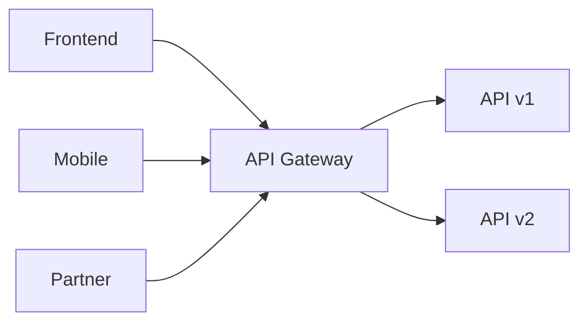
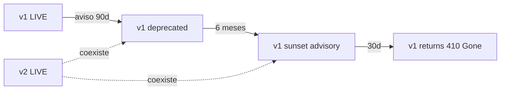
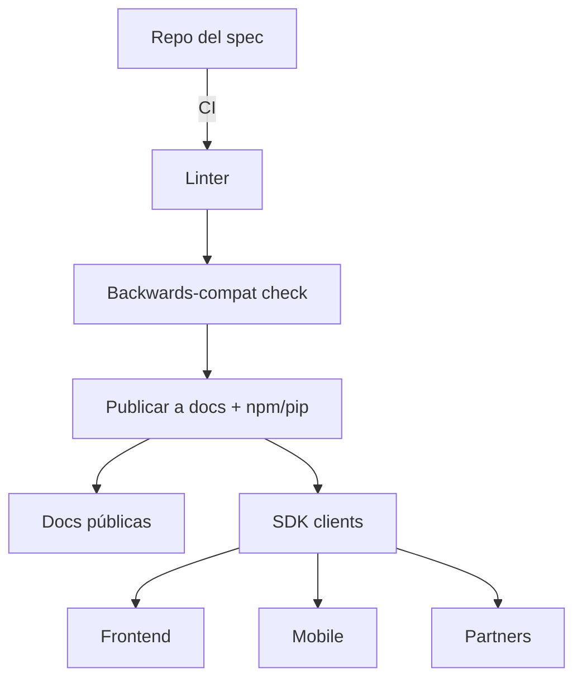

# Template: arch-api.md

**Generar cuando:** la API es el dominio central de la tarea. Es decir, la API es un producto en sí mismo — SDK público, OpenAPI compartido entre múltiples consumidores (frontend + mobile + partners), contrato versionado que vive más allá de un único servicio. Si la API es solo un endpoint interno de un servicio → documentar inline en `arch-backend.md` y NO crear este archivo.

## Template

```markdown
# Arquitectura de API — <TASK-ID>

## Vista (Topología del contrato)

<!-- arc42 § 5 / C4 Container. Diagrama estructural obligatorio de la API: consumidores, gateway, versiones activas y handlers. Es la vista whitebox del dominio API. -->



> El diagrama es la fuente principal de la vista. Los fragmentos OpenAPI/AsyncAPI ejecutables viven en el **Anexo — Contratos de interfaz** al final de este documento y en los archivos de spec del repo (`api/openapi.yaml`, `api/asyncapi.yaml`).

## Componentes principales

<!-- arc42 § 5 building-blocks (blackbox). Una fila por nodo del diagrama de topología. Describir responsabilidad, dependencias y consumidores expuestos. -->

| Componente / path | Responsabilidad | Depende de | Expuesto a |
|---|---|---|---|
| `API Gateway` | Routing, auth, rate limiting, versioning | Versiones activas (v1, v2) | Frontend, Mobile, Partners |
| `API v1` | Handlers de la versión 1 del contrato | Servicios de dominio | Gateway |

> Llenar una fila por cada nodo del diagrama de Vista. Marcar con `NEW` los componentes que esta tarea introduce.

## Restricciones no-funcionales

| Atributo | Requerimiento | Fuente |
|----------|---------------|--------|
| Latencia p99 | [valor concreto, ej. < 200ms] | requirements.md §NFR |
| Throughput | [valor concreto, ej. 500 RPS sostenidos] | requirements.md §NFR |
| Disponibilidad | [valor concreto, ej. 99.9% mensual] | requirements.md §NFR |
| Error budget | [valor concreto, ej. 43.8 min/mes] | derivado de disponibilidad |
| RTO | [valor concreto, ej. < 15 min] | requirements.md §NFR |
| Constraints de seguridad | [ej. TLS 1.2+, mTLS para partners, scopes OAuth] | requirements.md §NFR |
| Constraints de compliance | [ej. GDPR, SOC2, PCI-DSS] o N/A | requirements.md §NFR |

> Propagar los valores exactos de `requirements.md`. Si un atributo no aplica a este dominio, escribir `N/A` con una justificación de una línea.

---

## Schema canónico

### Formato

- [ ] OpenAPI 3.1.x (REST)
- [ ] AsyncAPI 3.x (eventos)
- [ ] Protocol Buffers + gRPC
- [ ] GraphQL SDL
- [ ] JSON Schema (para payloads sueltos)

### Ubicación de la fuente de verdad

| Tipo | Ruta | Convención |
|---|---|---|
| REST | `api/openapi.yaml` | Single file o split con `$ref` |
| Eventos | `api/asyncapi.yaml` | — |
| gRPC | `proto/<package>/v1/<service>.proto` | Una versión por subdirectorio |

**Regla:** el archivo en `api/` o `proto/` es **canónico** — los fragmentos de este documento son borradores para diseño. El developer y los consumidores leen el archivo canónico.

> Ver fragmento ejecutable en el **Anexo — Contratos de interfaz** al final.

### Convenciones obligatorias

- **Casing:** `camelCase` en JSON properties; `kebab-case` en path segments; `SCREAMING_SNAKE_CASE` en enums
- **Identificadores:** ULIDs/UUIDs en `id`. NUNCA exponer IDs autoincrementales de DB
- **Fechas:** ISO 8601 con timezone (`2025-05-20T10:00:00Z`)
- **Paginación:** cursor-based (`cursor` + `limit`) — NUNCA offset/limit en endpoints públicos
- **Idempotencia:** header `Idempotency-Key` en endpoints POST/PUT/PATCH; ventana de retención documentada
- **Content negotiation:** `application/json` por default; declarar variantes si aplican

---

## Estrategia de versionado

### Mecanismo elegido

- [ ] URL path (`/v1/`, `/v2/`) — preferido para APIs públicas con changesets agresivos
- [ ] Header `API-Version: 2025-05-20` — preferido para roll-forward continuo (estilo Stripe)
- [ ] Media type (`application/vnd.example.v2+json`) — menos común, alta granularidad
- [ ] Sin versionado explícito (single version forever) — solo si la API es 100% backwards-compatible

**Justificación de la elección:** [trade-offs evaluados]

### Política de bumps

| Tipo de cambio | Bump requerido | Ejemplo |
|---|---|---|
| Agregar endpoint nuevo | No (minor en metadata) | nuevo `/api/v1/widgets` |
| Agregar campo opcional al response | No | response gana `metadata: {...}` |
| Agregar campo opcional al request | No | body acepta `?notes` |
| Hacer obligatorio un campo previamente opcional | **Sí — major** | `email` ahora requerido |
| Renombrar campo | **Sí — major** | `created_at` → `createdAt` |
| Cambiar tipo de campo | **Sí — major** | `id: int` → `id: string` |
| Eliminar endpoint | **Sí — major** | `DELETE /api/v1/legacy` |
| Cambiar formato de error | **Sí — major** | `error: string` → `error: { code, message }` |

### Soporte concurrente

- **Versiones soportadas a la vez:** [N versiones, ej. v1 y v2 conviven 12 meses]
- **Default version si el cliente no especifica:** [v1 actual / la más nueva]
- **Hard switch:** [fecha en que v1 se apaga]

---

## Política de deprecación

### Timeline mínimo

| Etapa | Duración mínima | Acción |
|---|---|---|
| Aviso inicial | 90 días antes | Header `Deprecation: <date>` + entrada en changelog |
| Periodo de migración | 6 meses | Ambas versiones funcionan; docs marcan vieja como "deprecated" |
| Sunset advisory | 30 días antes del cierre | Header `Sunset: <RFC1123 date>` |
| Cierre | T0 | Endpoint devuelve `410 Gone` con `Link` a la nueva versión |

### Headers de deprecación

```
Deprecation: Sun, 31 Dec 2025 23:59:59 GMT
Sunset: Sun, 30 Jun 2026 23:59:59 GMT
Link: <https://api.example.com/v2/widgets>; rel="successor-version"
```

### Comunicación con consumidores

- Email a cada `<api_key>` activo registrado
- Entrada en `CHANGELOG.md` del repo de la API
- Banner en docs públicas (Redoc / Stoplight / Backstage TechDocs)
- Webhook opcional a partners (`api.deprecated` event)

---

## Backwards compatibility

### Qué cambios son breaking

- Eliminar un campo, endpoint, parámetro o response
- Renombrar (campos, paths, query params)
- Cambiar tipo o formato de un campo
- Hacer obligatorio lo que era opcional
- Cambiar el código HTTP de respuesta
- Cambiar el shape de un error
- Reducir el rango aceptado (ej. `maxLength` de 1000 a 500)
- Cambiar comportamiento default (ej. `limit` default de 20 a 10)

### Qué cambios NO son breaking

- Agregar endpoint, campo opcional, query param opcional, header opcional
- Agregar valor a un enum (con cuidado — clientes que hacen exhaustive matching pueden romperse → preferir documentar enums como abiertos)
- Aumentar `maxLength` o `maximum`
- Aceptar formatos adicionales en input (relajar)
- Mejorar mensajes de error (sin cambiar `code`)

### Estrategias para evitar breaks

- **Expand-then-contract:** primero agregar el nuevo campo, deprecar el viejo, sunset después
- **Tolerant reader:** documentar que los clientes deben ignorar campos desconocidos
- **Feature flags por consumidor:** experimentar sin afectar a todos
- **Versionado por header con date-based versioning:** clientes pinean una fecha y reciben semánticas estables

---

## Contract testing

### Estrategia

- [ ] Schema validation en CI (`redocly lint`, `spectral`, `buf lint`)
- [ ] Schema-driven tests (Schemathesis, Dredd) — fuzzing y validación contra OpenAPI
- [ ] Pact (consumer-driven contracts) — el consumidor define expectativas, el provider las verifica
- [ ] Postman / Hurl collections versionadas en el repo

### Pipeline mínimo

```
1. Linter de spec (redocly lint / spectral / buf lint) — bloquea PR si falla
2. Backwards-compat check (oasdiff / buf breaking) — bloquea PR si introduce break sin bump
3. Generación de clientes (openapi-generator / oapi-codegen / buf generate)
4. Tests de contrato del provider contra el spec
5. Publicación del spec (docs site + paquete npm/pip del cliente)
```

### Owners por endpoint

| Endpoint / namespace | Owner team | Slack channel | On-call |
|---|---|---|---|
| `/api/v1/widgets/*` | `team-widgets` | `#widgets-api` | rotación PagerDuty `widgets` |

---

## Consumidores registrados

| Consumidor | Tipo | Endpoints que consume | API key / scope | SLA |
|---|---|---|---|---|
| Frontend web (`app.example.com`) | first-party | `/api/v1/users/*`, `/api/v1/widgets/*` | scope `user:read user:write` | mismo SLO que API |
| App mobile iOS/Android | first-party | igual que web + `/api/v1/devices/*` | scope adicional `push:write` | mismo SLO |
| Partner `acme-corp` | third-party | `/api/v1/widgets/read` | API key con rate limit 1000/min | 99.5% (SLA contractual) |
| Internal worker `billing-service` | first-party server | `/api/v1/invoices/*` | mTLS + scope `billing:full` | best-effort |

**Regla:** mantener esta tabla actualizada — auditorías de seguridad y deprecation timelines dependen de ella.

---

## Rate limiting y throttling

### Esquema

| Tier | Límite | Ventana | Burst | Comportamiento al exceder |
|---|---|---|---|---|
| `anonymous` | 60 | 1 min | 10 | `429 Too Many Requests` |
| `authenticated` | 1000 | 1 min | 100 | `429 + Retry-After` |
| `partner:tier1` | 10000 | 1 min | 1000 | `429 + Retry-After` |
| `internal` | sin límite | — | — | — |

### Headers obligatorios en la respuesta

```
X-RateLimit-Limit: 1000
X-RateLimit-Remaining: 873
X-RateLimit-Reset: 1685000000
Retry-After: 42        # solo en 429
```

### Implementación

- **Backend:** [token bucket en Redis / sliding window log / fixed window counter]
- **Punto de aplicación:** API gateway (Kong/Tyk/Apigee) o middleware en el servicio
- **Bypass:** internal traffic vía service mesh con tag específico — NUNCA por header arbitrario del cliente

---

## Errores

### Formato canónico

```json
{
  "error": {
    "code": "validation_failed",
    "message": "Field 'email' must be a valid email address.",
    "details": [
      { "field": "email", "code": "format_invalid" }
    ],
    "requestId": "01HXYZABCDEF",
    "documentationUrl": "https://docs.example.com/errors/validation_failed"
  }
}
```

### Códigos HTTP usados

| Código | Significado | Cuándo usarlo |
|---|---|---|
| 200 | OK | Lectura exitosa, mutación exitosa con body |
| 201 | Created | POST creó el recurso, body contiene el nuevo recurso |
| 204 | No Content | DELETE o PUT/PATCH sin cuerpo de respuesta |
| 400 | Bad Request | Body malformado |
| 401 | Unauthorized | Falta auth o auth inválida |
| 403 | Forbidden | Auth válida pero sin permiso |
| 404 | Not Found | Recurso no existe (o no es visible para el caller) |
| 409 | Conflict | Estado actual incompatible con la operación (race, dup) |
| 422 | Unprocessable Entity | Validación de negocio falló |
| 429 | Too Many Requests | Rate limit |
| 500 | Internal Server Error | Bug del servidor |
| 502/503/504 | Bad Gateway / Service Unavailable / Gateway Timeout | Dependencia downstream |

---

## Runtime View

<!-- arc42 § 6 / C4 Dynamic. Diagrama de secuencia del flujo principal de un request a la API: consumer → gateway → versión activa → handler → respuesta. Incluir path de versión deprecada (header `Deprecation`/`Sunset`) y/o path de rate limiting (429). -->

```mermaid
sequenceDiagram
  participant Consumer
  participant Gateway
  participant API as API vN
  Consumer->>Gateway: request (Accept: application/vnd.api+json;v=N)
  Gateway->>API: route
  API-->>Gateway: 200 OK + headers de versión
  Gateway-->>Consumer: response
```

## Diagramas

### Flujo de versionado y deprecación



### Topología de publicación del contrato



---

## Preguntas abiertas

| # | Pregunta | Impacto si no se resuelve | Responsable | Deadline |
|---|----------|--------------------------|-------------|----------|
| 1 | [pregunta concreta] | [qué se bloquea] | [persona/rol] | [fecha o "antes de implementación"] |

> Si no hay preguntas abiertas, escribir explícitamente: "Ninguna — todas las ambigüedades fueron resueltas en el diseño."

## Anexo — Contratos de interfaz

> **Fragmento ilustrativo.** La fuente de verdad es el archivo de spec externo (`api/openapi.yaml`, `api/asyncapi.yaml`, `proto/<package>/v1/*.proto`). El YAML aquí es un borrador de diseño; los consumidores y el developer leen el archivo canónico.

```yaml
openapi: "3.1.0"
info:
  title: <API Name>
  version: 1.0.0
  description: ...

servers:
  - url: https://api.example.com/v1
    description: Production
  - url: https://api.staging.example.com/v1
    description: Staging

paths:
  /api/v1/<resource>:
    get:
      operationId: list<Resource>
      summary: ...
      parameters:
        - name: cursor
          in: query
          schema: { type: string }
        - name: limit
          in: query
          schema: { type: integer, minimum: 1, maximum: 100, default: 20 }
      responses:
        "200":
          description: ...
          content:
            application/json:
              schema:
                $ref: "#/components/schemas/<Resource>Page"
        "401":
          $ref: "#/components/responses/Unauthorized"
        "429":
          $ref: "#/components/responses/RateLimited"

components:
  schemas:
    <Resource>:
      type: object
      required: [id, createdAt]
      properties:
        id: { type: string, format: ulid }
        createdAt: { type: string, format: date-time }
  responses:
    Unauthorized:
      description: ...
    RateLimited:
      description: ...
      headers:
        Retry-After:
          schema: { type: integer }
```
```

## Reglas

- **El archivo en `api/` o `proto/` es la fuente de verdad** — los fragmentos de este documento son borradores. El consumidor lee el archivo canónico, no el markdown
- **Toda API pública versiona desde el día 1** — incluso si solo hay un consumidor hoy. La estrategia (path vs header) se elige UNA VEZ
- **Breaking changes requieren bump de versión** — sin excepciones. Si parece que necesitas un break sin bump, usa expand-then-contract
- **La tabla de consumidores se actualiza cuando aparece o se va un consumidor** — auditorías de deprecation dependen de ella
- **Rate limiting es obligatorio en endpoints públicos** — al menos para tier `anonymous` y `authenticated`
- **Formato de error es uniforme en toda la API** — los clientes parsean un solo shape
- **Si esta vista existe, `arch-backend.md` referencia los contratos pero no los duplica** — single source of truth
- **El changelog del spec se versiona en git** — los cambios se reviewan como código, no como docs
- **Trazabilidad a requirements:** cada endpoint nuevo idealmente liga a un FR de `requirements.md`
