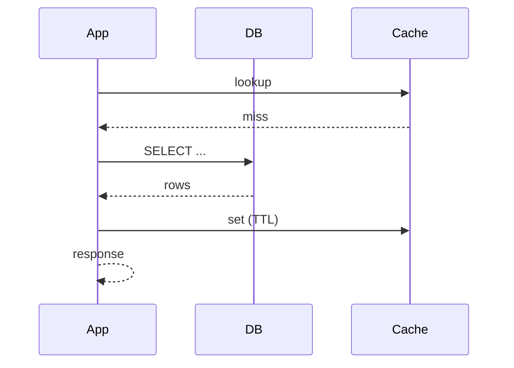

# Template: arch-database.md

**Generar cuando:** hay cambios de base de datos involucrados.

## Template

```markdown
# Arquitectura de Base de Datos — <TASK-ID>

## Vista (Diagrama ERD)

<!-- arc42 § 5 / C4 Container nivel datos. Diagrama estructural obligatorio: entidades y sus relaciones que componen el dominio de datos de este feature. -->

```mermaid
erDiagram
  ...
```

> El diagrama es la fuente principal de la vista. Las definiciones ejecutables (DBML / SQL DDL) viven en el **Anexo — Schema** al final de este documento y en los archivos de migración del repo.

## Componentes principales

<!-- arc42 § 5 building-blocks (blackbox). Una fila por entidad del ERD. Describir responsabilidad, relaciones clave y servicio dueño. -->

| Entidad / tabla | Responsabilidad | Relaciones clave | Owner (servicio) |
|---|---|---|---|
| `<table_name>` | Almacena el agregado raíz de `<feature>` | FK a `<other_table>` | `services/<svc>` |

> Llenar una fila por cada entidad del ERD. Marcar con `NEW` las tablas/columnas que esta tarea introduce.

## Restricciones no-funcionales

| Atributo | Requerimiento | Fuente |
|----------|---------------|--------|
| Latencia p99 | [valor concreto, ej. < 200ms] | requirements.md §NFR |
| Throughput | [valor concreto, ej. 500 RPS sostenidos] | requirements.md §NFR |
| Disponibilidad | [valor concreto, ej. 99.9% mensual] | requirements.md §NFR |
| Error budget | [valor concreto, ej. 43.8 min/mes] | derivado de disponibilidad |
| RTO | [valor concreto, ej. < 15 min] | requirements.md §NFR |
| Constraints de seguridad | [ej. TLS 1.2+, datos en reposo cifrados] | requirements.md §NFR |
| Constraints de compliance | [ej. GDPR, SOC2] o N/A | requirements.md §NFR |

> Propagar los valores exactos de `requirements.md`. Si un atributo no aplica a este dominio, escribir `N/A` con una justificación de una línea.

---

## Estrategia de migración

- **Tipo de gestión:** [migraciones en repo / SQL manual / sync tool / otro]
- **Estado de la DB:** [nueva / existente en dev / existente en producción]
- **Compatibilidad hacia atrás:** ...
- **Orden de deploy:** [migración antes de código / código antes de migración / simultáneo]
- **Plan de rollback:** ...
- **Backfill de datos:** ...
- **Riesgos de producción:** [bloqueos de tabla, downtime estimado, datos afectados]

## Índices recomendados

| Índice | Columnas | Justificación (qué query lo necesita) |
|---|---|---|

## Patrones de consulta

<!-- Patrones de query esperados e implicaciones de rendimiento -->
- ...

## Runtime View

<!-- arc42 § 6 / C4 Dynamic. Diagrama de secuencia del flujo principal de datos: write path (validación → transacción → commit → outbox) o read path (cache → query → projection). Incluir contención (locks, isolation level) o consistencia eventual si aplica. -->



## Preguntas abiertas

| # | Pregunta | Impacto si no se resuelve | Responsable | Deadline |
|---|----------|--------------------------|-------------|----------|
| 1 | [pregunta concreta] | [qué se bloquea] | [persona/rol] | [fecha o "antes de implementación"] |

> Si no hay preguntas abiertas, escribir explícitamente: "Ninguna — todas las ambigüedades fueron resueltas en el diseño."

## Anexo — Schema

> **Fragmento ilustrativo.** La fuente de verdad es el archivo de migración SQL en el repo. El DBML/SQL aquí es un borrador de diseño para comunicar la intención del schema; el agente DBA genera las migraciones canónicas a partir de esta intención.

<!-- Formato DBML — borrador de diseño legible. -->

```dbml
Table <table_name> {
  id text [pk, note: 'ULID']
  field1 text [not null]
  field2 integer [default: 0]
  created_at datetime [not null, default: `CURRENT_TIMESTAMP`]

  indexes {
    field1 [name: 'idx_<table>_field1']
    (field1, field2) [name: 'idx_<table>_compound']
  }
}

Ref: <table_name>.foreign_id > other_table.id
```

<!-- Alternativa: SQL DDL intent para cambios simples -->

```sql
-- Intent: agregar tracking de status a tabla runs
ALTER TABLE runs ADD COLUMN status TEXT NOT NULL DEFAULT 'pending';
ALTER TABLE runs ADD COLUMN finished_at DATETIME;
CREATE INDEX idx_runs_status ON runs(status);
```
```

## Patrones de acceso — incluir si aplica

<!-- Describir cómo fluyen los datos más allá de CRUD simple -->

### CQRS — incluir si hay separación read/write
- **Lado write:** qué tabla/aggregate recibe comandos
- **Lado read:** qué tabla/view sirve queries (puede ser diferente)
- **Sincronización:** cómo el lado read se actualiza (evento, trigger, polling)

### Event sourcing — incluir si el estado se reconstruye de eventos
- **Event store:** tabla donde se persisten eventos (`id`, `aggregate_id`, `event_type`, `payload`, `occurred_at`)
- **Snapshot:** frecuencia, tabla de snapshots
- **Proyecciones:** qué read models se construyen y cómo

### Outbox pattern — incluir si se publican eventos desde DB
- **Tabla outbox:** `id`, `topic`, `payload`, `published_at` (null = pendiente)
- **Poller / relay:** quién lee y publica los mensajes pendientes
- **Garantía:** at-least-once delivery desde DB hacia broker

## Reglas

- DBML es el formato preferido para tablas nuevas — legible por máquinas, genera migraciones
- SQL DDL intent es aceptable para cambios simples de ALTER TABLE
- Cada índice debe tener justificación — qué query lo necesita
- La estrategia de migración debe abordar rollback — qué pasa si necesitamos revertir
- El diagrama ERD muestra relaciones, no todas las columnas — mantenerlo legible
- El schema intent debe coincidir con los tipos de persistencia backend si ambas vistas existen
- NUNCA proponer tablas nuevas sin confirmar que las existentes no pueden extenderse
- Incluir sección "Patrones de acceso" cuando la feature usa eventos, proyecciones, o paths separados de read/write — tareas CRUD simples pueden omitirla
