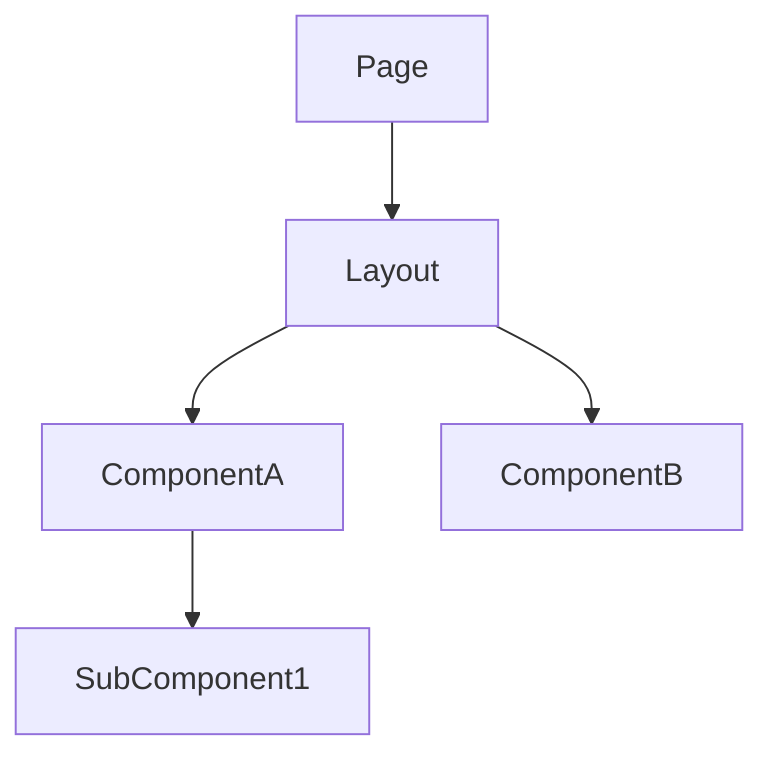
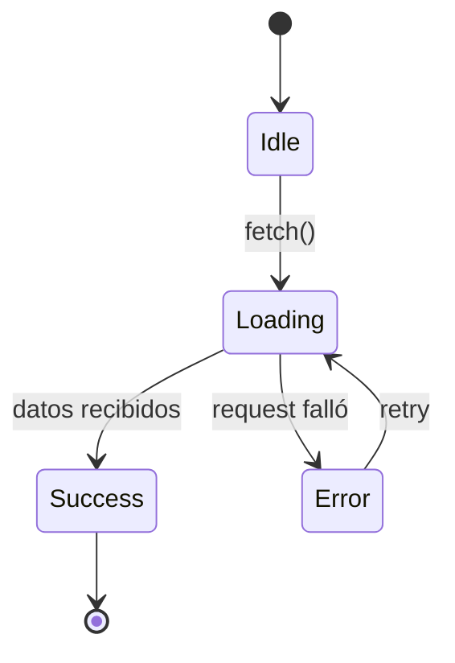

# Template: arch-frontend.md

**Generar cuando:** hay trabajo de frontend involucrado.

## Template

```markdown
# Arquitectura Frontend — <TASK-ID>

## Restricciones no-funcionales

| Atributo | Requerimiento | Fuente |
|----------|---------------|--------|
| Latencia p99 | [valor concreto, ej. < 200ms] | requirements.md §NFR |
| Throughput | [valor concreto, ej. 500 RPS sostenidos] | requirements.md §NFR |
| Disponibilidad | [valor concreto, ej. 99.9% mensual] | requirements.md §NFR |
| Error budget | [valor concreto, ej. 43.8 min/mes] | derivado de disponibilidad |
| RTO | [valor concreto, ej. < 15 min] | requirements.md §NFR |
| Constraints de seguridad | [ej. TLS 1.2+, datos en reposo cifrados] | requirements.md §NFR |
| Constraints de compliance | [ej. GDPR, SOC2] o N/A | requirements.md §NFR |

> Propagar los valores exactos de `requirements.md`. Si un atributo no aplica a este dominio, escribir `N/A` con una justificación de una línea.

---

## Patrones de integración usados

<!-- Marcar cuáles aplican. Incluir solo esas secciones abajo. -->
- [ ] REST / HTTP (fetch, axios, Tauri invoke)
- [ ] WebSockets / SSE (tiempo real)
- [ ] Eventos recibidos del backend (event bus, broadcast)
- [ ] Polling
- [ ] Estado local únicamente (sin backend)

---

## Jerarquía de componentes

<!-- arc42 § 5 / C4 Component. Diagrama estructural obligatorio: páginas, layouts y componentes principales que componen la vista. -->



## Componentes principales

<!-- arc42 § 5 building-blocks (blackbox). Una fila por componente del diagrama. Describir responsabilidad, estado consumido y eventos emitidos, NO implementación interna. -->

| Screen / Componente | Responsabilidad | Estado que consume | Eventos que emite |
|---|---|---|---|
| `<PageName>` | Punto de entrada de la ruta; orquesta layout y componentes hijos | `<Feature>State` (store global) | `route:enter`, `route:leave` |

> Llenar una fila por cada nodo del diagrama. Marcar con `NEW` los componentes que esta tarea introduce.

## Capa de integración

<!-- Cómo el frontend consume cada patrón del backend -->

### REST / Tauri invoke
- **Cliente:** fetch / axios / invoke — cuál y por qué
- **Manejo de errores:** qué hace el UI ante 4xx / 5xx / timeout
- **Cache / revalidation:** estrategia (stale-while-revalidate, no-cache, etc.)

### WebSockets / SSE — incluir si aplica
- **Endpoint / topic:** ...
- **Reconexión:** estrategia (backoff, límite de intentos)
- **Estado de conexión:** cómo lo expone el UI (indicador, fallback)
- **Mensajes esperados:** schema de cada mensaje recibido

### Polling — incluir si aplica
- **Intervalo:** ...
- **Condición de stop:** ...
- **Qué activa un re-fetch:** ...

---

## Máquina de estados de la entidad principal — incluir si aplica



## Variables de entorno del cliente — incluir si aplica

<!-- Env vars expuestas al browser/cliente. NUNCA secretos aquí — todo es público. -->

| Variable | Ejemplo | Framework | Descripción |
|---|---|---|---|
| `VITE_API_URL` | `http://localhost:8080` | Vite | URL base de la API |

**Reglas:**
- Sin el prefijo del framework, la variable NO se expone al cliente — esto es intencional (seguridad)
- **Nunca** poner API keys, secrets, o tokens en env vars del cliente — son visibles en el bundle
- Env vars del cliente van en `.env.example` con el prefijo correcto
- Variables server-side (SSR de Next/Nuxt) no necesitan prefijo público — tratarlas como backend

## Rutas y navegación

| Ruta | Componente | Guard | Lazy |
|---|---|---|---|

## Runtime View

<!-- arc42 § 6 / C4 Dynamic. Flujo de datos del escenario principal: acción del usuario → componente → store/hook → cliente HTTP → backend → re-render. Incluir happy path + path de fallo (error, loading, retry). -->

```mermaid
sequenceDiagram
  ...
```

## Preguntas abiertas

| # | Pregunta | Impacto si no se resuelve | Responsable | Deadline |
|---|----------|--------------------------|-------------|----------|
| 1 | [pregunta concreta] | [qué se bloquea] | [persona/rol] | [fecha o "antes de implementación"] |

> Si no hay preguntas abiertas, escribir explícitamente: "Ninguna — todas las ambigüedades fueron resueltas en el diseño."

## Anexo — Contratos de tipos

> **Referencia de diseño.** Los tipos/interfaces/clases exactas se definen en `spec.md` durante la implementación. Este anexo documenta la intención del contrato para alinear frontend y backend antes de implementar.

<!-- Interfaces TypeScript. Deben coincidir con contratos backend exactamente — mismos nombres de campo, mismos tipos. -->

```typescript
// Derivado de contratos REST/command del backend
interface <ResponseDTO> {
  id: string;
  // ...
}

// Props del componente
interface <ComponentName>Props {
  data: <ResponseDTO>;
  onAction: (id: string) => void;
}

// Forma del store / estado
interface <Feature>State {
  items: <ResponseDTO>[];
  loading: boolean;
  error: string | null;
}
```

## Anexo — Referencia de configuración

> **Referencia operativa.** Este anexo centraliza las convenciones de naming y variables comunes como referencia rápida. La configuración de entorno canónica vive en `.env.example` y el runbook del proyecto.

### Convenciones por framework

| Framework | Prefijo obligatorio | Acceso en código | Archivo |
|---|---|---|---|
| **Vite** | `VITE_` | `import.meta.env.VITE_*` | `.env`, `.env.local` |
| **Next.js** | `NEXT_PUBLIC_` | `process.env.NEXT_PUBLIC_*` | `.env.local` |
| **Create React App** | `REACT_APP_` | `process.env.REACT_APP_*` | `.env` |
| **Astro** | `PUBLIC_` | `import.meta.env.PUBLIC_*` | `.env` |
| **Nuxt** | `NUXT_PUBLIC_` | `useRuntimeConfig().public.*` | `.env` |

### Variables comunes de frontend

| Variable | Uso |
|---|---|
| `VITE_API_URL` / `NEXT_PUBLIC_API_URL` | URL base del backend |
| `VITE_WS_URL` / `NEXT_PUBLIC_WS_URL` | URL del WebSocket |
| `VITE_APP_ENV` | Entorno (development / staging / production) |
| `VITE_SENTRY_DSN` | DSN de Sentry para error tracking del cliente |
| `VITE_ANALYTICS_ID` | ID de Google Analytics / Plausible / etc. |
| `VITE_FEATURE_*` | Feature flags del cliente |
```

## Reglas

- Las interfaces TypeScript DEBEN coincidir con contratos backend — mismos nombres de campo, mismos tipos, mismo optional/required
- Incluir SOLO secciones que apliquen — omitir secciones vacías completamente
- La sección WebSocket/SSE es obligatoria si el backend emite eventos en tiempo real — no describir como "polling" si es push
- Diagrama de máquina de estados requerido para entidades con más de 2 estados de UI (loading/error/success/empty/stale)
- Los contratos de props definen la API pública del componente — qué recibe y emite
- La tabla de rutas incluye guards (auth, permisos) y estrategia de lazy loading
- Si existe vista backend, las interfaces frontend se DERIVAN de esos contratos — no se definen independientemente
- Las env vars del cliente son PÚBLICAS — nunca secretos. Si necesitas un secret en SSR (Next/Nuxt), documentarlo sin prefijo público y tratarlo como backend
- Toda env var nueva debe agregarse al `.env.example` con el prefijo correcto del framework
