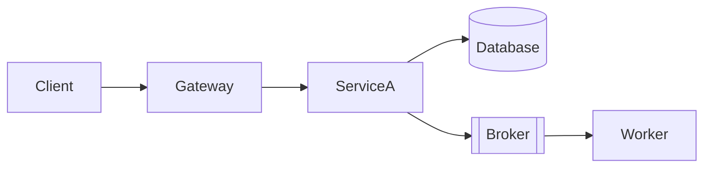
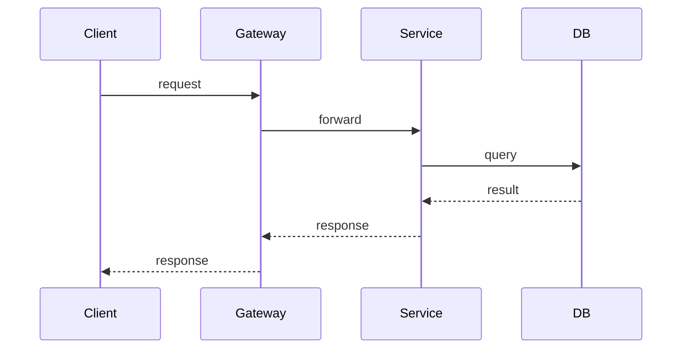

# Template: arch-infrastructure.md

**Generar cuando:** hay cambios de infraestructura involucrados.

## Template

```markdown
# Arquitectura de Infraestructura — <TASK-ID>

## Componentes involucrados

<!-- Marcar cuáles aplican -->
- [ ] Servicios / containers (API, workers, schedulers)
- [ ] Message broker (Kafka / RabbitMQ / SQS / Redis Streams)
- [ ] Base de datos
- [ ] Cache (Redis, Memcached)
- [ ] CDN / storage (S3, GCS)
- [ ] Cron / scheduled jobs
- [ ] API Gateway / load balancer

---

## Topología de despliegue

<!-- arc42 § 7 Deployment View / C4 Deployment. Diagrama estructural obligatorio de cómo se despliegan los contenedores en la infraestructura. -->



## Componentes principales

<!-- arc42 § 5 building-blocks (blackbox) aplicado al nivel de despliegue. Una fila por nodo del diagrama. Describir responsabilidad y exposición. -->

| Componente / path | Responsabilidad | Depende de | Expuesto a |
|---|---|---|---|
| `api-gateway` | Routing, TLS termination, rate limiting | Servicios upstream | Internet público |

> Llenar una fila por cada nodo del diagrama de topología. Marcar con `NEW` los componentes que esta tarea introduce.

## Runtime View

<!-- arc42 § 6 / C4 Dynamic. Mostrar el flujo principal de un request o evento atravesando la infraestructura: client → gateway → service → broker/db → respuesta. Incluir path de fallo (failover, retry, escalado automático). -->



## Brokers y colas — incluir si aplica

| Broker | Topic / Queue | Producers | Consumers | Retención | DLQ |
|---|---|---|---|---|---|

- **Modo de entrega:** at-most-once / at-least-once / exactly-once
- **Escalado de consumers:** estrategia (consumer groups, concurrency)
- **Backpressure:** qué pasa si el consumer no puede seguir el ritmo

## Variables de entorno y secretos

<!-- Usar los nombres estándar definidos en arch-backend.md §Variables de entorno. -->
<!-- Esta tabla es el contrato de deploy — lo que ops necesita configurar por entorno. -->

| Variable | Tipo | Descripción | Requerida | Secreto |
|---|---|---|---|---|

## Escalabilidad

- **Triggers de escalado:** ...
- **Límites de recursos (CPU/mem):** ...
- **Bottlenecks conocidos:** ...

## Restricciones no-funcionales

| Atributo | Requerimiento | Fuente |
|----------|---------------|--------|
| Latencia p99 | [valor concreto, ej. < 200ms] | requirements.md §NFR |
| Throughput | [valor concreto, ej. 500 RPS sostenidos] | requirements.md §NFR |
| Disponibilidad | [valor concreto, ej. 99.9% mensual] | requirements.md §NFR |
| Error budget | [valor concreto, ej. 43.8 min/mes] | derivado de disponibilidad |
| RTO | [valor concreto, ej. < 15 min] | requirements.md §NFR |
| Constraints de seguridad | [ej. TLS 1.2+, datos en reposo cifrados] | requirements.md §NFR |
| Constraints de compliance | [ej. GDPR, SOC2] o N/A | requirements.md §NFR |

> Propagar los valores exactos de `requirements.md`. Si un atributo no aplica a este dominio, escribir `N/A` con una justificación de una línea.

## Observabilidad

- **Métricas clave:** qué counters/gauges/histograms emite esta feature
- **Alertas:** qué condición dispara una alerta (ej. DLQ > 0, latencia p95 > 500ms)
- **Logs estructurados:** qué campos obligatorios en cada log line

## Impacto CI/CD

<!-- Archivos de pipeline específicos que necesitan cambios -->
- ...

## Seguridad de infraestructura

- **Red:** segmentación, puertos expuestos
- **Secretos:** dónde se almacenan, cómo se inyectan
- **Acceso:** IAM roles, service accounts, mínimo privilegio

## Preguntas abiertas

| # | Pregunta | Impacto si no se resuelve | Responsable | Deadline |
|---|----------|--------------------------|-------------|----------|
| 1 | [pregunta concreta] | [qué se bloquea] | [persona/rol] | [fecha o "antes de implementación"] |

> Si no hay preguntas abiertas, escribir explícitamente: "Ninguna — todas las ambigüedades fueron resueltas en el diseño."

## Anexo — Referencia de configuración

> **Referencia operativa.** Este anexo centraliza las reglas de naming y mapping a ConfigMap/Secrets como referencia rápida. La configuración canónica vive en los manifests de despliegue del proyecto.

### Reglas de env vars en infra

- Los nombres DEBEN coincidir con los definidos en `arch-backend.md` y `arch-frontend.md` — si backend define `KAFKA_BROKERS`, infra configura `KAFKA_BROKERS`, no `KAFKA_BOOTSTRAP_SERVERS`
- Separar ConfigMap (no-sensibles) de Secrets (sensibles) — la columna "Secreto" determina cuál
- Documentar valores por entorno cuando difieren (dev: `localhost`, staging: `broker.staging`, prod: `broker.prod`)
- Variables de frontend público (`VITE_*`, `NEXT_PUBLIC_*`) van en el build, no en runtime — documentar en qué paso del CI se inyectan
```

## Reglas

- Incluir SOLO secciones que apliquen — omitir secciones vacías completamente
- La sección de brokers/colas es obligatoria si se usa cualquier patrón async — documentar DLQ siempre
- La tabla "Restricciones no-funcionales" es requerida para tareas Medium+ — usar `N/A` con justificación solo si explícitamente es un job background sin impacto al usuario
- La sección de observabilidad debe nombrar métricas específicas — "agregar logging" no es suficiente
- El diagrama de despliegue muestra servicios y conexiones — no código interno
- Cada env var debe especificar tipo (string, int, bool, secret), si es requerida, y si es secreto
- Los nombres de env vars DEBEN coincidir exactamente con los definidos en backend.md y frontend.md — infra no renombra variables
