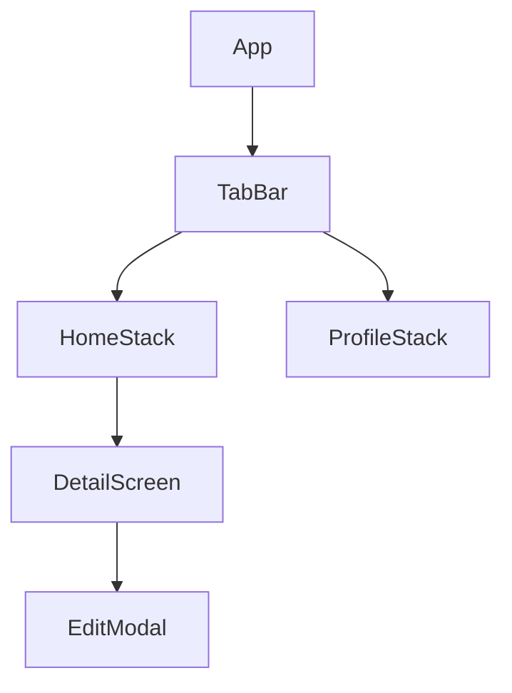
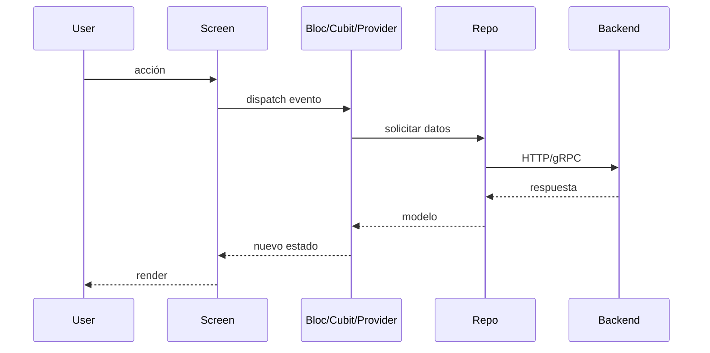
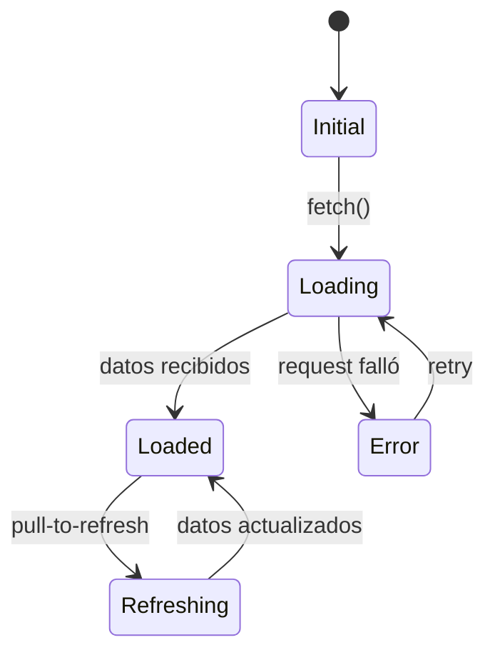

# Template: arch-mobile.md

**Generar cuando:** hay trabajo de mobile involucrado (Flutter, React Native, Swift, Kotlin).

## Template

```markdown
# Arquitectura Mobile — <TASK-ID>

## Plataformas objetivo

- [ ] iOS
- [ ] Android
- [ ] Ambas (Flutter / React Native)

## Restricciones no-funcionales

| Atributo | Requerimiento | Fuente |
|----------|---------------|--------|
| Latencia p99 | [valor concreto, ej. < 200ms] | requirements.md §NFR |
| Throughput | [valor concreto, ej. 500 RPS sostenidos] | requirements.md §NFR |
| Disponibilidad | [valor concreto, ej. 99.9% mensual] | requirements.md §NFR |
| Error budget | [valor concreto, ej. 43.8 min/mes] | derivado de disponibilidad |
| RTO | [valor concreto, ej. < 15 min] | requirements.md §NFR |
| Constraints de seguridad | [ej. TLS 1.2+, datos en reposo cifrados] | requirements.md §NFR |
| Constraints de compliance | [ej. GDPR, SOC2] o N/A | requirements.md §NFR |

> Propagar los valores exactos de `requirements.md`. Si un atributo no aplica a este dominio, escribir `N/A` con una justificación de una línea.

## Patrones de comunicación con backend

<!-- Marcar cuáles aplican. Incluir solo esas secciones abajo. -->
- [ ] REST / HTTP
- [ ] WebSockets / SSE (tiempo real)
- [ ] gRPC
- [ ] Push notifications (FCM / APNs)
- [ ] Deep links / universal links
- [ ] Estado local únicamente (sin backend)

---

## Navegación

<!-- arc42 § 5 / C4 Component. Stack-based, tab-based, drawer, modal flows. Diagrama estructural obligatorio de la composición de screens. -->



## Componentes principales

<!-- arc42 § 5 building-blocks (blackbox). Una fila por screen/componente principal del diagrama. Describir responsabilidad, estado consumido y eventos emitidos. -->

| Screen / Componente | Responsabilidad | Estado que consume | Eventos que emite |
|---|---|---|---|
| `HomeScreen` | Vista principal post-login; lista de items | `<Feature>State` via BLoC/Provider | `home:refresh`, `home:item-tap` |

> Llenar una fila por cada screen/componente del diagrama. Marcar con `NEW` los que esta tarea introduce.

| Ruta / Screen | Stack | Guard (auth, permisos) | Deep link path |
|---|---|---|---|

### Deep linking — incluir si aplica
- **Scheme:** `myapp://` o universal links `https://domain.com/path`
- **Mapeo:** qué deep link abre qué screen
- **Fallback:** qué pasa si el deep link llega sin auth o con datos inválidos

---

## Runtime View

<!-- arc42 § 6 / C4 Dynamic. Diagrama de secuencia del escenario principal del usuario: screen → bloc/cubit → repo → backend → estado → re-render. Incluir happy path + path de fallo (offline, error de red, token expirado). -->



---

## Gestión de estado

<!-- BLoC, Riverpod, Provider, Redux, MobX — cuál y por qué -->
- **Patrón:** ...
- **Scope:** global vs por-feature vs por-screen
- **Persistencia de estado:** qué estado sobrevive kill de app (y dónde: SQLite, shared prefs, secure storage)

### Máquina de estados — incluir si la feature tiene más de 2 estados



---

## Estrategia offline — incluir si aplica

- **Nivel de soporte:** online-only / offline-read / offline-first
- **Almacenamiento local:** SQLite, Hive, shared preferences, secure storage — cuál y para qué datos
- **Sincronización:** estrategia de sync (queue local → push al reconectar, merge de conflictos)
- **Conflictos:** last-write-wins / merge manual / server-wins
- **Indicador de estado:** cómo el UI comunica modo offline al usuario

---

## Ciclo de vida de la app

- **Background:** qué pasa cuando la app va a background (pausar streams, guardar estado)
- **Foreground resume:** qué se revalida al volver (tokens, datos stale)
- **Kill y restore:** qué estado se restaura vs qué se re-fetches
- **Session management:** expiración de tokens, refresh strategy

---

## Push notifications — incluir si aplica

- **Proveedor:** FCM / APNs / ambos
- **Tipos de notificación:** data-only, notification+data, topic-based, targeted
- **Manejo en foreground:** mostrar in-app banner / silenciar / custom UI
- **Manejo en background:** qué procesa sin abrir la app
- **Deep link desde notificación:** a qué screen navega y con qué datos

---

## Permisos del dispositivo — incluir si aplica

| Permiso | Cuándo se solicita | Fallback si deniegan | Plataforma |
|---|---|---|---|
| Cámara | ... | ... | iOS + Android |
| Ubicación | ... | ... | iOS + Android |
| Notificaciones | ... | ... | iOS + Android |

---

## Variables de entorno / configuración de runtime — incluir si aplica

<!-- Mobile no usa .env como backend/web. La config se inyecta de formas distintas por plataforma. -->

| Variable | Ejemplo | Mecanismo | Descripción |
|---|---|---|---|
| `API_BASE_URL` | `https://api.example.com` | Build flavor / scheme | URL base de la API |

**Reglas:**
- **Nunca** hardcodear URLs o keys en código fuente — siempre inyectar via config
- Secrets (API keys privadas) van en secure storage del dispositivo o se obtienen post-auth — nunca en el bundle
- Documentar en el `.env.example` del proyecto las variables que `flutter_dotenv` o `react-native-config` leen
- Cada build flavor/scheme (dev, staging, prod) debe tener su propio set de variables

## Capa de integración con backend

### REST / gRPC
- **Cliente:** dio / http / retrofit — cuál y por qué
- **Manejo de errores:** qué hace el UI ante errores de red, timeouts, 4xx, 5xx
- **Retry:** estrategia (exponential backoff, límite de intentos)
- **Cache de respuestas:** estrategia (cache-first, network-first, stale-while-revalidate)

### WebSockets / SSE — incluir si aplica
- **Reconexión:** backoff, límite, fallback a polling
- **Estado de conexión:** indicador visual para el usuario

---

## Consideraciones de plataforma — incluir si aplica

### Diferencias iOS vs Android
- **Navigation patterns:** ...
- **Permisos:** diferencias en el flujo de solicitud
- **Background execution:** límites por plataforma

### Platform channels / FFI — incluir si aplica
- **Canal:** qué operación nativa se expone
- **Serialización:** formato de datos entre Dart/JS y native

## Preguntas abiertas

| # | Pregunta | Impacto si no se resuelve | Responsable | Deadline |
|---|----------|--------------------------|-------------|----------|
| 1 | [pregunta concreta] | [qué se bloquea] | [persona/rol] | [fecha o "antes de implementación"] |

> Si no hay preguntas abiertas, escribir explícitamente: "Ninguna — todas las ambigüedades fueron resueltas en el diseño."

## Anexo — Contratos de tipos

> **Referencia de diseño.** Los tipos/interfaces/clases exactas se definen en `spec.md` durante la implementación. Este anexo documenta la intención del contrato para alinear mobile y backend antes de implementar.

<!-- Modelos Dart/Kotlin/Swift. Deben coincidir con contratos backend exactamente. -->

```dart
// Derivado de contratos REST/gRPC del backend
class ResponseDTO {
  final String id;
  // ...
}

// Estado de la feature
class FeatureState {
  final List<ResponseDTO> items;
  final bool loading;
  final String? error;
}
```

## Anexo — Referencia de configuración

> **Referencia operativa.** Este anexo centraliza las convenciones de naming y variables comunes como referencia rápida. La configuración de entorno canónica vive en el `.env.example` (o equivalente del framework) y el runbook del proyecto.

### Mecanismos por framework

| Framework | Cómo se inyecta config | Archivo / herramienta |
|---|---|---|
| **Flutter** | `--dart-define=KEY=VALUE` en build, o `flutter_dotenv` | `.env` + `flutter_dotenv` package, o `--dart-define` |
| **React Native** | `react-native-config` | `.env`, `.env.staging`, `.env.production` |
| **Native iOS** | Xcode schemes + `Info.plist` / xcconfig | `.xcconfig` por environment |
| **Native Android** | Build flavors + `BuildConfig` | `build.gradle` productFlavors |

### Variables comunes de mobile

| Variable | Uso |
|---|---|
| `API_BASE_URL` | URL base del backend |
| `WS_URL` | URL del WebSocket |
| `APP_ENV` | Entorno (dev / staging / prod) |
| `SENTRY_DSN` | DSN de Sentry para crash reporting |
| `ANALYTICS_KEY` | Key de analytics (Firebase, Amplitude, etc.) |
| `FEATURE_*` | Feature flags |
```

## Reglas

- Las clases/interfaces de tipos DEBEN coincidir con contratos backend — mismos nombres de campo, mismos tipos
- Incluir SOLO secciones que apliquen — omitir secciones vacías completamente
- La sección offline es obligatoria si la app debe funcionar sin conexión — "siempre online" debe declararse explícitamente
- La sección de push notifications es obligatoria si el backend emite eventos al dispositivo
- Permisos del dispositivo deben documentar el fallback cuando el usuario deniega — no solo "solicitar permiso"
- La estrategia de gestión de estado debe justificar el patrón elegido — no solo nombrar la librería
- Deep linking debe mapear cada ruta a un screen con su guard de auth
- Si existe vista backend, los modelos mobile se DERIVAN de esos contratos — no se definen independientemente
- Ciclo de vida es obligatorio para features que usan streams, timers, o estado temporal
- Toda config de runtime nueva debe documentarse con su mecanismo de inyección por framework
- Secrets nunca en el bundle — solo en secure storage post-auth o via backend proxy
