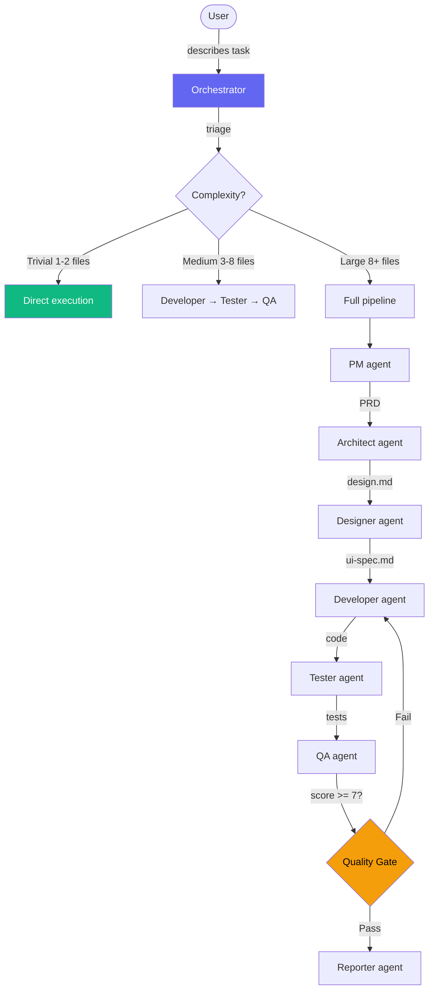

[Leer en espanol](README.es.md)

# Anvil

AI agent orchestration system. Define agents, skills, and conventions once — deploy to Claude Code, OpenCode, Gemini CLI, Codex, and Cursor. Compatible with the [AGENTS.md](https://agents.md/) open standard.

<p align="center">
  
</p>

## What is Anvil?

Anvil is a collection of **agents** (specialized AI roles), **skills** (domain knowledge and conventions), and a **CLI** that deploys them to your AI coding tools. Write your agents and skills in markdown, run `anvil browse`, and every tool gets the same knowledge.

Anvil automatically generates an `AGENTS.md` file — the [open standard](https://agents.md/) maintained by the Linux Foundation and adopted by Codex, Cursor, Copilot, and others.

## User Manual

For a complete guide on daily usage — invoking skills, using agents, typical workflows, per-stack conventions, and tips — read the **[User Manual](docs/manual.md)**.

## Quick Start

```bash
# 1. Clone
git clone https://github.com/ernesto2108/anvil.git ~/projects/anvil
cd ~/projects/anvil

# 2. Build the CLI (requires Go 1.25+)
make build

# 3. Make it available globally (optional)
ln -sf ~/projects/anvil/anvil /usr/local/bin/anvil

# 4. First-time setup
anvil init

# 5. Browse, select, and install agents/skills/commands
anvil browse
```

> After step 3, you can run `anvil` from anywhere. If you skip it, use `./anvil` from the anvil directory.

## Interactive TUI

`anvil browse` launches an interactive terminal UI where you can explore all agents, skills, and commands — then install or uninstall them per target with a single keystroke.

<p align="center">
  
</p>

Features:
- **Tab switching** between Agents, Skills, and Commands views
- **Search/filter** to quickly find what you need
- **Per-target toggling** — install to Claude only, or all targets at once
- **Deploy modes** — copy (permanent) or symlink (always in sync)
- **Keyboard-driven** — `enter` to install, `d` to uninstall, `t` to toggle targets

## How It Works



Each agent has strict boundaries:
- **developer** writes production code only
- **tester** writes test files only
- **dba** manages migrations only
- **devops** manages infra/CI only
- Agents never cross boundaries

## Project Structure

```
anvil/
├── cmd/anvil/             # CLI entry point (Go)
├── internal/
│   ├── cli/               # CLI commands (init, status, doctor, etc.)
│   ├── deploy/            # Deploy providers per target
│   └── tui/               # Interactive TUI (Bubble Tea)
├── anvil.yaml             # Deployment manifest (targets, components)
├── anvil.config.yaml      # Provider & model mapping
├── agents/                # 13 specialized agent definitions
├── skills/                # 44 domain skills and conventions
├── commands/              # User-invocable slash commands
├── docs/                  # Documentation (en + es)
├── examples/              # CLAUDE.md template for projects
└── vault-template/        # Obsidian vault template for documentation
```

## Agents

Each agent is a markdown file with YAML frontmatter defining its role, permissions, and model tier.

| Agent | Role | Permission | Tier |
|-------|------|------------|------|
| **pm** | Requirements, PRDs, backlog, sprint planning | write | high |
| **architect** | System design, API contracts, ADRs | write | high |
| **designer** | UX/UI design, design system, user flows | write | high |
| **developer-backend** | Production code — Go (APIs, services, workers) | execute | medium |
| **developer-frontend** | Production code — React/TypeScript/Astro | execute | medium |
| **developer-mobile** | Production code — Flutter/Dart | execute | medium |
| **tester** | Test files across all stacks | execute | medium |
| **dba** | Migrations, schema design, query optimization | execute | medium |
| **devops** | CI/CD, Docker, Terraform, K8s, cloud infra | execute | medium |
| **qa** | Code review, quality gate (blocks if score < 7) | execute | medium |
| **security** | SAST, SCA, secrets audit, auth review | execute | medium |
| **context-init** | Project context initialization and refresh (3 modes: init, deep, regular) | execute | medium |
| **tech-writer** | Documentation, README, API docs, changelogs | write | medium |
| **reporter** | Session execution reports + `.project-context/` delta updates | execute | low |
| **mkt-content** | Content marketing, copywriting, visual assets | execute | high |

### How agents work

- **You are the orchestrator.** There is no automatic leader agent — you decide which agent to invoke based on the task.
- **Trivial** tasks: execute directly, no agents needed
- **Medium+**: invoke agents in sequence, respecting gates between phases
- Each agent has strict boundaries — developer-backend can't touch tests, tester can't touch production code
- Choose the right developer agent for the stack: `developer-backend` for Go, `developer-frontend` for React/TypeScript/Astro, `developer-mobile` for Flutter/Dart
- **Documenting is part of done**: after tests pass on any task or bug fix, invoke `reporter` to update `.project-context/`

### Permissions

| Level | Available tools |
|-------|----------------|
| **read** | Glob, Grep, LS, Read |
| **write** | + Write, Edit |
| **execute** | + Bash |

### Model tiers

| Tier | Use case | Claude example | Gemini example |
|------|----------|----------------|----------------|
| **high** | Complex decisions (PM, Architect) | Opus | gemini-2.5-pro |
| **medium** | Implementation (Developer, Tester) | Sonnet | gemini-2.5-flash |
| **low** | Simple tasks (Reporter) | Haiku | gemini-2.5-flash-lite |

## Skills

Skills are loadable knowledge modules. Agents load them on-demand based on the task.

### Per-Stack Conventions

| Skill | Covers |
|-------|--------|
| `/go-conventions` | Error handling, validation, SQL, concurrency, testing, Kafka, RabbitMQ |
| `/react-conventions` | Hooks, state management, Tailwind v4, accessibility, testing, anti-patterns |
| `/flutter-conventions` | BLoC/Riverpod, widget composition, theming, testing |
| `/astro-conventions` | Islands, content collections, components, styling |
| `/python-conventions` | Type hints 3.12+, Pydantic v2, pytest, numpy, async, security |
| `/typescript-conventions` | Strict mode, discriminated unions, Zod, Vitest, ESLint v8, Node.js ESM |
| `/rust-conventions` | Edition 2024, tokio, clap, Solana/Anchor, async, CLI patterns |
| `/devops-conventions` | Docker, GitHub Actions, Terraform, K8s, AWS, GCP, Argo CD/Workflows/Rollouts |

### Workflow Skills

| Skill | Purpose |
|-------|---------|
| `/orchestrate` | Triage complexity, select agents, manage gates |
| `/lint` | Auto-detect stack, run linters and formatters |
| `/run-tests` | Auto-detect stack, run tests with coverage |
| `/perf` | Load/stress testing with Vegeta, k6, Locust |
| `/design-system` | Create design tokens, variables, components (Pencil/Figma) |
| `/design-project` | Quick entry point for design projects, auto-detects tool |
| `/design-recipes` | Reusable design patterns for efficient screen building |
| `/design-review` | Quality audit of designs with scoring |
| `/design-to-code` | Translate designs to production code |
| `/prd-template` | PRD writing with discovery questionnaire |
| `/backlog-management` | Break PRDs into tickets, manage sprints |
| `/handoff` | Session continuity — create/resume handoff notes across sessions |
| `/scan-project` | Scan repo structure and generate context.md |
| `/cross-service-dev` | Orchestrate changes across multiple microservice repos |

### Guard Skills

| Skill | Purpose |
|-------|---------|
| `/architecture-boundary-guardrails` | Enforce bounded contexts, prevent cross-domain leaks |
| `/domain-entity-guardrails` | Strict typing, no pointers for optional fields |
| `/code-review-rubric` | Scoring criteria for QA reviews |
| `/skill-standards` | Standards and checklist for creating new skills |

### Utility Skills

| Skill | Purpose |
|-------|---------|
| `/dependency-check` | Audit packages for vulnerabilities and licenses |
| `/bundle-analyzer` | Frontend bundle size impact analysis |
| `/db-schema-scan` | Read-only schema inspection via migrations |
| `/db-optimize` | Slow query identification, index suggestions |
| `/generate-diagram` | Mermaid.js diagrams (C4, ERD, sequence, flow) |
| `/git-diff` | Summarize repository changes |
| `/summarize-changes` | Write human-readable session summary to vault |
| `/service-map` | Cross-service dependency awareness |
| `/a11y-check` | WCAG 2.1 accessibility audit |
| `/test-api` | API endpoint contract validation |
| `/e2e-test-run` | End-to-end tests (Playwright, Cypress) |
| `/ui-component-scan` | Scan component library for reuse |
| `/visual-diff` | Screenshot comparison for visual regressions |
| `/document-architecture` | Auto-document service architecture |
| `/social-content` | Social media content creation (LinkedIn, Instagram, X) |
| `/task-complete` | Mark tasks done, update Kanban board |

## CLI Reference

<p align="center">
  
</p>

```bash
# Setup
anvil init                       # First-time setup — show config and launch browser
anvil browse                     # Interactive TUI to manage agents/skills/commands
anvil update                     # Pull latest + rebuild binary

# Targets (which AI tools to deploy to)
anvil targets                    # Show active targets
anvil targets claude opencode    # Set exact targets
anvil targets --add gemini       # Enable one target
anvil targets --rm cursor        # Disable one target
anvil targets all                # Enable all

# Provider (model mapping)
anvil provider                   # Show current provider
anvil provider gemini            # Switch to Gemini models
anvil provider local             # Switch to local/Ollama models

# Diagnostics
anvil status                     # Show version, branch, targets, tags
anvil doctor                     # Diagnose deployment health
anvil diff                       # Show changes since last deploy

# Version pinning
anvil pin skills/go-conventions v1.2.0    # Pin to git tag
anvil unpin skills/go-conventions         # Follow HEAD again

# Maintenance
anvil uninstall                  # Remove from all targets
```

## MCP Server

Anvil exposes an MCP server so Claude Code (or any MCP-compatible client) can query runs, memories, backlog, and orchestration state directly in conversation — no manual file reading required.

### Setup

Add to `~/.claude/settings.json`:

```json
{
  "mcpServers": {
    "anvil": {
      "command": "anvil",
      "args": ["mcp-server"],
      "env": {
        "ANVIL_VAULT_PATH": "/path/to/your-knowledge-base"
      }
    }
  }
}
```

> `ANVIL_VAULT_PATH` is optional. Without it, vault tools (`get_backlog`, `get_task`) are disabled but all other tools work.

### Real conversation examples

These are copy-paste prompts for a fresh Claude Code chat. Each example shows what you type and what Claude does.

---

#### 1. See what's in my project

```
What's the current state of my project? Check recent runs, backlog, and any relevant memories.
```

Claude will call `get_project_info`, `list_runs`, `get_backlog`, and `search_memories` to give you a full status summary without you opening any files.

---

#### 2. Get coding conventions before working

```
I'm about to write a new Go handler. Load the Go conventions so you follow the project's patterns.
```

Claude calls `get_conventions` with `stack="go"` and applies the rules to everything it writes in that session.

---

#### 3. Start a tracked orchestration run

```
Start tracking a new orchestration. Objective: add a /metrics endpoint to the API. Stack: Go. Complexity: medium.
```

Claude calls `start_orchestration` and returns a `run_id`. Every agent step gets saved with `save_step` automatically if you're using the `/orchestrate` skill. In a manual conversation, Claude will tell you the `run_id` to use in follow-up messages.

---

#### 4. Save what an agent produced

After the developer agent finishes, in the same or a new chat:

```
Save the developer step for run r_20260424_143000_a1b2. Status: success. It touched internal/api/metrics.go and internal/api/router.go. Duration was about 4 minutes.
```

Claude calls `save_step` with the right arguments and confirms the step was recorded.

---

#### 5. Save a gate decision

```
Save a gate step for run r_20260424_143000_a1b2. The user approved the architect spec. Role: gate, status: success, gate_decision: approved.
```

Claude calls `save_step` with `gate_decision="approved"`. If the pipeline is resumed later, it will know this gate was already resolved.

---

#### 6. Pause mid-session and resume later

**Session 1 — before closing:**
```
Pause the current orchestration run r_20260424_143000_a1b2 so I can resume it tomorrow.
```

Claude calls `complete_orchestration` with `status="paused"`.

**Session 2 — next day:**
```
Check if I have any interrupted pipelines and show me what's pending.
```

Claude calls `load_orchestration(run_id="last")` and shows you the `pending_roles` and the output of completed steps. If you confirm, it resumes from where it left off — the first `save_step` includes `resume=true` to reactivate the run.

---

#### 7. Look up what a specific agent produced

```
Show me the full output of the architect agent from my last run.
```

Claude calls `get_agent_output` with `run_id="last"` and `agent_role="architect"` and shows you the complete output text — no need to dig through files.

---

#### 8. Search past decisions before starting work

```
Before I implement the auth middleware, search memories for anything related to session tokens or JWT decisions in past runs.
```

Claude calls `search_memories` with a semantic query and surfaces relevant digests from past pipeline runs — decisions, edge cases, patterns already established.

---

#### 9. Close a completed run

```
Mark run r_20260424_143000_a1b2 as successfully completed.
```

Claude calls `complete_orchestration` with `status="success"`, records `ended_at`, and the run is no longer eligible for resume.

---

#### 10. Full health check

```
Run a full health check on my Anvil setup and tell me if anything is broken.
```

Claude calls `run_doctor` and reports on: deployed SHA vs HEAD, config files, provider tiers, target directories, and broken symlinks.

---

### Checkpointing & Resume

Runs can be paused and resumed across sessions:

| Scenario | What to say |
|----------|-------------|
| Pipeline finished | "Mark run `r_xxx` as successfully completed" |
| Pipeline failed | "Close run `r_xxx` as failed" |
| Closing mid-session | "Pause run `r_xxx` so I can resume tomorrow" |
| Resuming tomorrow | "Check if I have any interrupted pipelines" |
| Manual resume | "Resume run `r_xxx` — save the tester step with resume=true" |

The `/orchestrate` skill handles this automatically at session start (Step -2). In a manual conversation, call `load_orchestration(run_id="last")` yourself to inspect state before starting a new run.

### Available tools

| Tool | What it does |
|------|-------------|
| `list_runs` | Recent pipeline runs |
| `get_run_status` | Full status + agents for a run |
| `get_agent_output` | Full output of a specific agent |
| `start_orchestration` | Create a conversational run |
| `save_step` | Persist an agent step (supports `gate_decision`, `resume`) |
| `load_orchestration` | Load run + pending roles for resume |
| `complete_orchestration` | Close or pause a run |
| `search_memories` | Semantic search over past run digests |
| `get_conventions` | Load coding conventions for a stack |
| `get_backlog` | Current sprint backlog (requires vault) |
| `get_task` | PRD + architecture docs for a task (requires vault) |
| `list_agents` | All available Anvil agents |
| `list_skills` | All available Anvil skills |
| `list_pipelines` | Available pipeline presets |
| `get_project_info` | Project name, stack, provider, last run |
| `get_recent_changes` | Recent commits + runs |
| `run_doctor` | Health check on deployment |
| `deploy_agents` | Deploy agents/skills to targets |
| `switch_provider` | Change active AI provider |
| `get_diff` | Changes since last deploy |

## Configuration

### `anvil.yaml` — Deployment manifest

```yaml
targets:
  claude:
    enabled: true
    path: ~/.claude
  opencode:
    enabled: true
    path: ~/.config/opencode
  gemini:
    enabled: true
    path: ~/.gemini
  codex:
    enabled: true
    path: ~/.codex
  cursor:
    enabled: true
    path: per-project

components:
  agents:
    tag: "HEAD"
  skills:
    tag: "HEAD"
  commands:
    tag: "HEAD"
```

### `anvil.config.yaml` — Provider & model mapping

```yaml
provider: claude

providers:
  claude:
    high: opus
    medium: sonnet
    low: haiku
  cursor:
    high: claude-opus-4-20250514
    medium: claude-sonnet-4-20250514
    low: claude-haiku-4-5-20251001
  gemini:
    high: gemini-2.5-pro
    medium: gemini-2.5-flash
    low: gemini-2.5-flash-lite
  local:
    high: qwen3:32b
    medium: qwen3:14b
    low: qwen3:8b
```

## Backup & Restore

Anvil automatically protects your existing files:

- **First deploy**: snapshots everything found in `~/.claude/`, `~/.codex/`, etc.
- **Each deploy**: timestamps backup if it detects manual changes
- **Uninstall**: restores original files from the snapshot

See [full section in the manual](docs/manual.md#8-backup--restore).

## AGENTS.md Compatibility

[AGENTS.md](https://agents.md/) is an open standard maintained by the Linux Foundation for configuring AI agents in software projects. Anvil generates this file automatically on every deploy.

### Which tools read it?

| Tool | Reads AGENTS.md | Native file |
|---|---|---|
| **OpenAI Codex** | Yes (primary) | `~/.codex/AGENTS.md` |
| **Cursor** | Yes (repo root) | `.cursor/rules/*.mdc` |
| **GitHub Copilot** | Via `.github/copilot-instructions.md` | `.github/agents/*.agent.md` |
| **OpenCode** | Yes (primary) | — |
| **Claude Code** | No (uses `CLAUDE.md`) | `~/.claude/agents/*.md` |
| **Gemini CLI** | Discussion active | `GEMINI.md` |

### How it works in Anvil

1. Define agents in `agents/*.md` with frontmatter (role, permissions, tier)
2. When installing via `anvil browse`, Anvil:
   - Deploys native agents to each target (Claude, OpenCode, Gemini, etc.)
   - Generates compact `AGENTS.md` to `~/.codex/` for Codex
3. Any AGENTS.md-compatible tool can read the generated file

## Creating New Agents

Create `agents/{name}.md`:

```markdown
---
name: my-agent
description: One-line description the system uses to decide when to invoke this agent
permission: execute    # read | write | execute
model: medium          # high | medium | low
---

# Agent Spec — Role Title

## Role
What this agent does and what it does NOT do.

## Input
What the orchestrator provides.

## Rules
Specific constraints and permissions.

## Output
What it produces and where.
```

## Creating New Skills

Create `skills/{name}/SKILL.md`:

```markdown
---
name: my-skill
description: One-line description of what this skill teaches
---

# Skill Name

## When to Load
Conditions that trigger loading this skill.

## Content
The actual knowledge, conventions, and patterns.
```

For complex skills, use subdirectories with a routing table:

```
skills/my-conventions/
├── SKILL.md           # Dispatcher with routing table
├── rules/             # Quick reference files
├── guides/            # Detailed patterns
└── examples/          # Good + bad patterns
```

## Documentation Vault

Use `vault-template/` to bootstrap an Obsidian vault for any project:

```bash
cp -r vault-template/ ~/projects/my-project-knowledge-base/
```

Structure:
```
01-project/context.md         # Scanner output
02-backlog/sprint-current.md  # Sprint board
03-tasks/<ID>/                # PRD, design, QA per task
04-architecture/              # ADRs, bounded contexts
05-bugs/                      # Postmortems
06-reports/last-run.md        # Session reports
07-references/                # Templates, external links
08-design/                    # Design files (.pen, .fig)
```

## License

MIT
