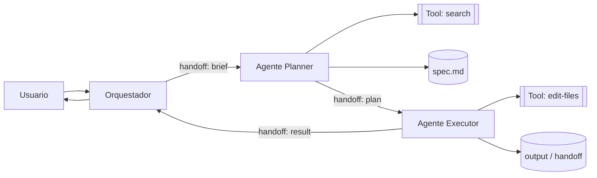
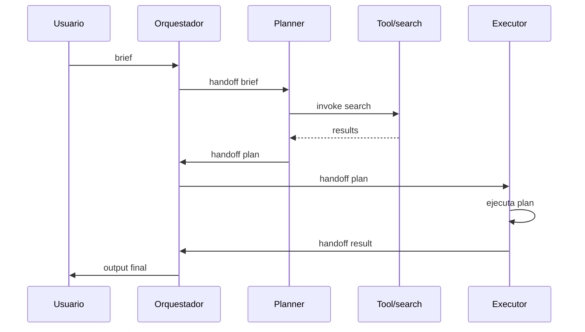
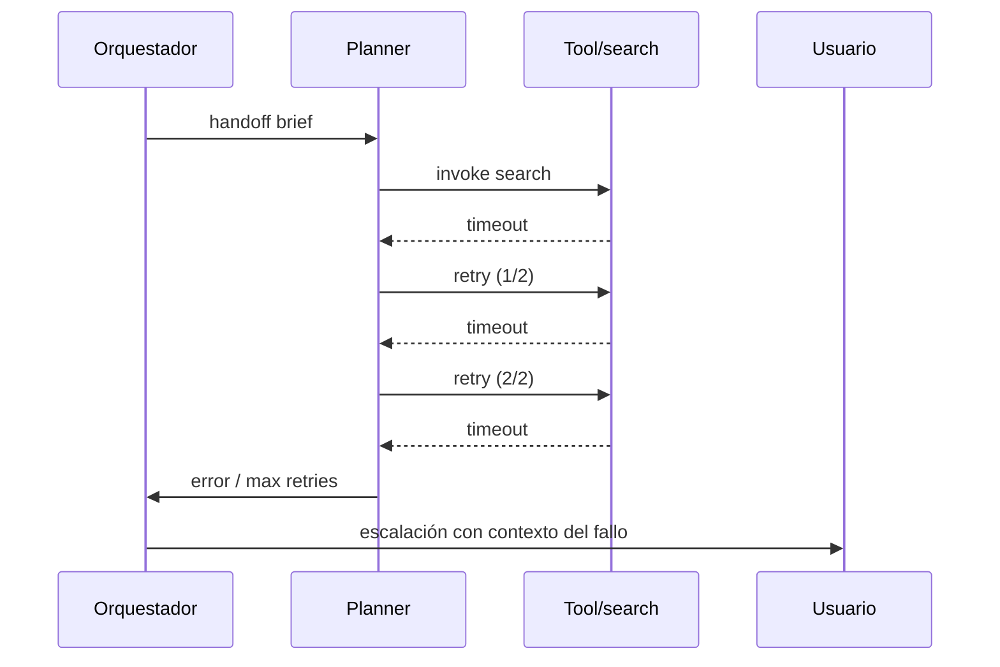

# Template: arch-agents.md

**Generar cuando:** la feature introduce o modifica un sistema agéntico (pipeline multi-agente, orquestador, agentes LLM con tools, handoffs entre agentes, skills/commands que componen un flujo de IA).

## Template

```markdown
# Arquitectura de Agentes — <TASK-ID>

## Vista de agentes (C4 L2 — Containers adaptado)

<!-- Diagrama estructural obligatorio: agentes, tools, artefactos persistidos, orquestador y handoffs. Adaptación C4 Container para sistemas agénticos según "Describing Agentic AI Systems with C4" (arxiv 2603.15021). arc42 § 5. -->
<!-- Convenciones: agentes como nodos rectangulares, tools como [[doble bracket]], artefactos persistidos como [(cilindro)], handoffs con label `-->|handoff: nombre|`. NO usar `|` dentro de los labels de nodos — usar `/` en su lugar. -->



> Mostrar SOLO los agentes y tools que participan en este flujo. Los contratos de handoff y los efectos externos viven en las secciones "Protocolo de handoff" y "Herramientas".

---

## Agentes y roles

<!-- arc42 § 5 building-blocks (blackbox) adaptado a agentes. Una fila por agente del diagrama. Describir el rol y los contratos de entrada/salida, NO el prompt interno. -->

| Agente / path | Rol | Herramientas que usa | Produce | Consume |
|---|---|---|---|---|
| `agents/planner.md` | Descompone el brief en tareas atómicas | `search`, `read-files` | `plan.json` | brief del usuario |
| `agents/executor.md` | Ejecuta cada tarea del plan | `edit-files`, `run-tests` | handoff de resultado | `plan.json` |

> Llenar una fila por cada agente del diagrama. Marcar con `NEW` los agentes que esta tarea introduce y `MODIFIED` los que cambian de contrato.

---

## Herramientas (Tools / Skills)

<!-- Inventario de tools disponibles para los agentes. El "efecto externo" indica si la tool muta estado fuera del proceso del agente (filesystem, red, BD). "Reversible" indica si el efecto se puede deshacer sin intervención humana. -->

| Herramienta | Tipo (skill/command/MCP tool) | Owner | Efecto externo | Reversible |
|---|---|---|---|---|
| `search` | MCP tool | sistema | ninguno (read-only) | N/A |
| `edit-files` | skill | executor | filesystem (escritura) | sí (git) |
| `run-tests` | command | executor | proceso hijo (CPU) | sí |
| `deploy` | command | ops-agent | red + infra (despliegue) | no — requiere rollback manual |

> Toda tool con `Reversible = no` requiere quality gate humano antes de invocarse (ver sección "Quality gates").

---

## Restricciones no-funcionales

| Atributo | Requerimiento | Fuente |
|----------|---------------|--------|
| Latencia p99 por agente | [valor concreto, ej. < 30s] | requirements.md §NFR |
| Presupuesto de tokens por agente | [valor concreto, ej. 50k tokens] | requirements.md §NFR |
| Tool calls máximos por agente | [valor concreto, ej. 25] | requirements.md §NFR |
| Tasa de éxito mínima | [valor concreto, ej. 90% pipelines completos] | requirements.md §NFR |
| Tiempo máximo de pipeline end-to-end | [valor concreto, ej. < 10 min] | requirements.md §NFR |
| Costo máximo por run | [valor concreto, ej. $0.50 USD] | requirements.md §NFR |
| Constraints de privacidad de datos | [ej. no enviar PII a LLM externo] | requirements.md §NFR |

> Propagar los valores exactos de `requirements.md`. Si un atributo no aplica a este pipeline, escribir `N/A` con una justificación de una línea.

---

## Patrones de coordinación

<!-- Marcar SOLO los patrones que aplican. Un pipeline puede combinar varios (ej. orquestador-ejecutor con human-in-the-loop en quality gates). -->

- [ ] Secuencial — un agente después de otro, sin paralelismo
- [ ] Paralelo — varios agentes ejecutan al mismo tiempo, resultados se combinan
- [ ] Orquestador-ejecutor — un agente coordina, otros ejecutan subtareas
- [ ] Peer-to-peer — agentes se invocan mutuamente sin coordinador central
- [ ] Human-in-the-loop — pausa explícita para validación humana en uno o más pasos

### Flujo elegido

<!-- 2-3 líneas describiendo qué patrón se usa, por qué, y referencia al ADR si la decisión está justificada formalmente. -->

Ej: Orquestador-ejecutor con human-in-the-loop en el quality gate previo a `deploy`. El orquestador secuencia planner → executor → reviewer; el humano valida solo cuando hay efectos no-reversibles. Decisión justificada en `adr/0007-pipeline-coordination.md`.

---

## Protocolo de handoff

<!-- El handoff es el contrato persistido entre agentes. Definir el formato canónico (preferentemente artefacto en disco, NO contexto implícito) y los campos obligatorios. -->

**Formato:** archivo markdown persistido en `.handoff/<TASK-ID>.md` (o JSON si la próxima etapa es no-LLM).

```markdown
---
task_id: TASK-123
from_agent: planner
to_agent: executor
created_at: 2026-06-01T10:00:00Z
---

## Input
<payload concreto que el siguiente agente debe procesar>

## Context
<artefactos relevantes, paths, decisiones previas>

## Done-when
- [ ] criterio 1 verificable
- [ ] criterio 2 verificable
```

| Campo | Tipo | Obligatorio | Descripción |
|---|---|---|---|
| `task_id` | string | sí | Identificador único del run; permite trazabilidad cross-agente |
| `input` | markdown / JSON | sí | Payload que el siguiente agente procesa — debe ser autocontenido |
| `context` | markdown | sí | Artefactos relevantes, decisiones previas, paths a leer |
| `done_when` | checklist | sí | Criterios verificables que definen "completado" para el siguiente agente |

> Regla dura: ningún agente recibe contexto implícito. Todo lo que necesite para ejecutar va en el handoff persistido.

---

## Memoria y estado

<!-- Inventario de los tipos de estado del pipeline. "Scope" indica visibilidad (un agente, todo el pipeline, cross-pipeline). -->

| Tipo | Mecanismo | Scope | TTL |
|---|---|---|---|
| Contexto en ventana | ventana del LLM | un turn del agente | hasta cierre de invocación |
| Artefactos en disco | archivos en `.handoff/` y outputs del repo | pipeline completo | persistente (git) |
| Estado de tarea | tracker externo (Anvil MCP / backlog) | cross-pipeline | persistente |
| Embeddings / RAG | vector store | cross-pipeline | configurable (típicamente días) |

> Si el pipeline necesita memoria cross-run, declarar explícitamente el mecanismo (ej. resúmenes en `.project-context/`). No depender de la memoria del LLM entre invocaciones.

---

## Runtime View

<!-- arc42 § 6 / C4 Dynamic adaptado. Dos diagramas obligatorios: happy path completo y al menos un flujo de fallo crítico (tool timeout, validación rechazada, presupuesto agotado). -->

### Happy path



### Flujo de fallo crítico (tool timeout)



---

## Quality gates

<!-- Puntos de control del pipeline. Cada gate valida algo específico y define qué hacer si falla. Los gates humanos son obligatorios antes de cualquier tool con efecto no-reversible. -->

| Gate | Dónde | Qué valida | Acción si falla |
|---|---|---|---|
| Pre-flight | Antes de invocar al primer agente | Brief tiene `done_when` explícito; presupuesto y permisos declarados | Pedir al usuario los campos faltantes; no iniciar pipeline |
| Output validation | Salida de cada agente | Handoff cumple el esquema obligatorio; `done_when` está marcado | Reintento del agente con feedback; máx 1 reintento |
| Human checkpoint | Antes de tools con `Reversible = no` | Humano aprueba la acción y revisa el plan | Pausa del pipeline hasta confirmación explícita |

---

## Taxonomía de fallos

<!-- Clasificación específica para sistemas agénticos. Cada tipo declara si es retryable automáticamente y la mitigación estándar. -->

| Tipo | Retryable | Descripción | Mitigación |
|---|---|---|---|
| Tool timeout | sí (máx 2 retries, backoff exponencial) | La tool no respondió dentro del SLA | Retry con backoff; si persiste, escalar al orquestador |
| Context overflow | no | El agente excedió la ventana de contexto del modelo | Resumir handoff previo; subdividir tarea; cambiar a modelo de mayor contexto |
| Hallucination de output | parcial (1 retry con feedback) | El agente produjo output que no valida contra el esquema esperado | Re-invocar con el error específico; si persiste, escalar a humano |
| Dependencia no resuelta | no | Falta un artefacto upstream (handoff, archivo, schema) | Detener pipeline; reportar qué falta y qué agente debió producirlo |
| Permiso denegado | no | El agente intentó una tool fuera de su scope autorizado | Detener inmediatamente; reportar violación de scope al usuario |

---

## Preguntas abiertas

- [ ] [pregunta concreta sobre el pipeline]
- [ ] [pregunta concreta sobre coordinación o handoff]
- [ ] [pregunta concreta sobre presupuesto o quality gate]

> Si no hay preguntas abiertas, escribir explícitamente: "Ninguna — todas las ambigüedades fueron resueltas en el diseño."

## Reglas

- Todo agente declara `done_when` explícito antes de ejecutar — sin criterio verificable, no se invoca
- Ningún agente toma decisiones con efecto no-reversible sin pasar por un quality gate humano
- Los handoffs son artefactos persistidos en disco — nunca contexto implícito heredado del turn anterior
- Fallos de tool retryables tienen máximo 2 reintentos con backoff exponencial; tras eso se escala al orquestador
- Si el pipeline supera el presupuesto declarado (tokens, tool calls, tiempo, costo) → escalar al humano, nunca continuar silenciosamente
```
