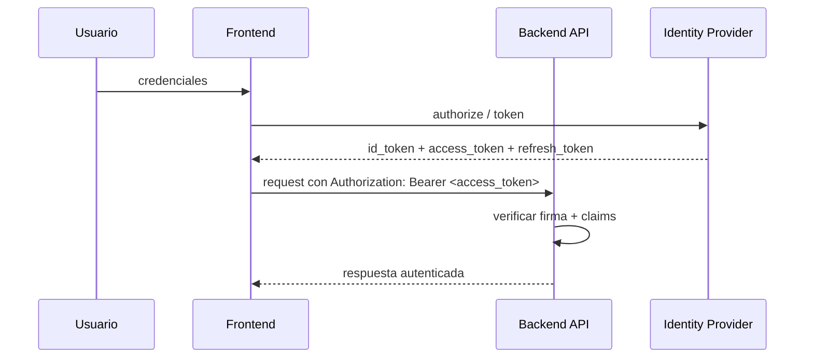
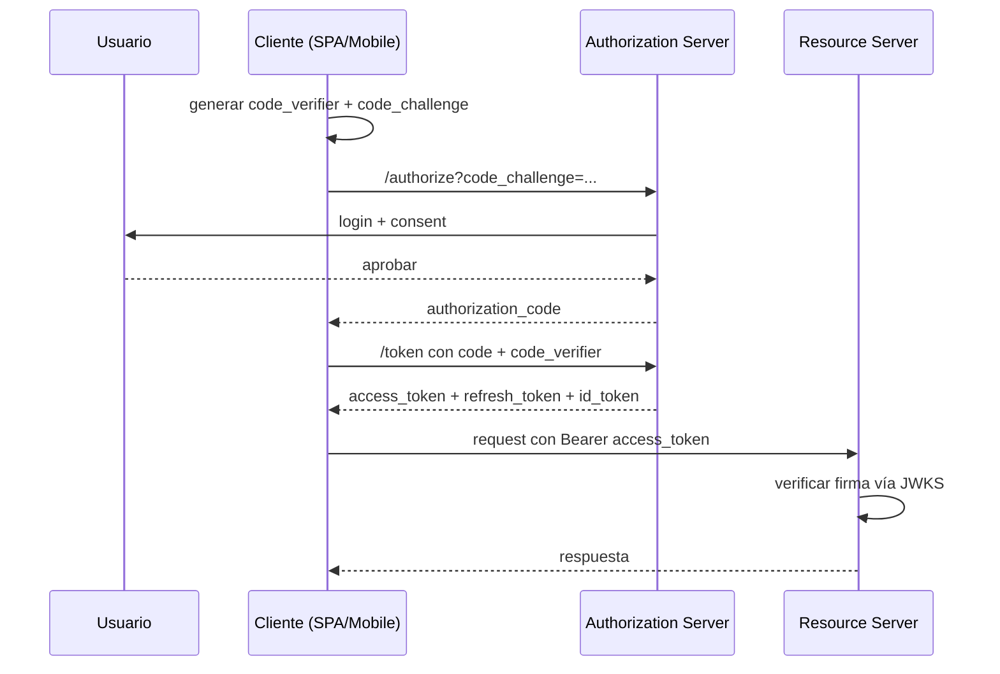
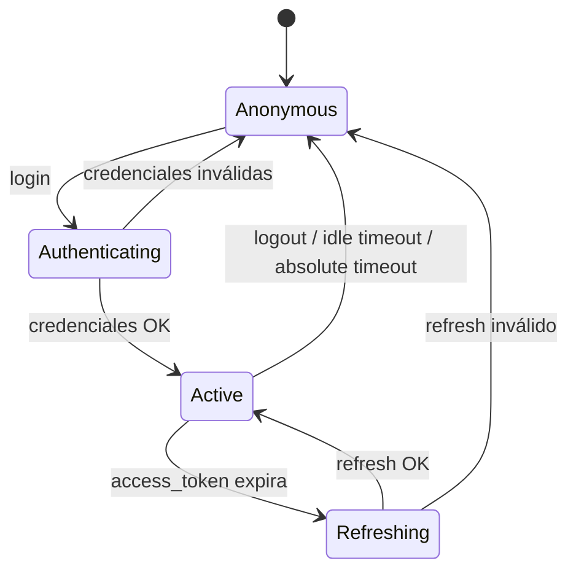

# Template: arch-auth.md

Inspirado en: OWASP ASVS + OAuth 2.1 Security Best Current Practice + NIST SP 800-63.

**Generar cuando:** la tarea tiene a auth (identidad, autorización, tokens, sesiones) como dominio central. Si la tarea solo agrega un guard de auth a un endpoint existente y la auth ya está modelada en otro lado → documentar inline en `arch-backend.md` y NO crear este archivo.

## Template

```markdown
# Arquitectura de Autenticación / Autorización — <TASK-ID>

## Alcance del cambio

### In scope
- <qué actores, flujos, políticas y componentes de identidad ESTÁN incluidos en este cambio>

### Out of scope
- <qué NO está incluido — explícito, no asumido>

### Archivos involucrados

| Archivo | Acción | Capa | Justificación |
|---|---|---|---|
| `path/al/archivo` | CREATE / MODIFY / DELETE | dominio / handler / repo / infra / ui | razón de ubicación |

<!--
Instrucción para el architect: poblar esta tabla con TODOS los archivos que toca el feature
(middlewares de auth, policies de autorización, modelos de usuario/sesión, integraciones con IdP,
endpoints de login/logout/refresh, etc.).
Los archivos NEW (acción CREATE) deben tener justificación de ubicación explícita.
Esta tabla es el contrato de handoff hacia el `spec-writer`.
-->

---

## Restricciones no-funcionales

| Atributo | Requerimiento | Fuente |
|----------|---------------|--------|
| Latencia p99 | [valor concreto, ej. < 200ms] | requirements.md §NFR |
| Throughput | [valor concreto, ej. 500 RPS sostenidos] | requirements.md §NFR |
| Disponibilidad | [valor concreto, ej. 99.9% mensual] | requirements.md §NFR |
| Error budget | [valor concreto, ej. 43.8 min/mes] | derivado de disponibilidad |
| RTO | [valor concreto, ej. < 15 min] | requirements.md §NFR |
| Constraints de seguridad | [ej. TLS 1.2+, datos en reposo cifrados, MFA obligatorio] | requirements.md §NFR |
| Constraints de compliance | [ej. GDPR, SOC2, HIPAA, PCI-DSS] o N/A | requirements.md §NFR |

> Propagar los valores exactos de `requirements.md`. Si un atributo no aplica a este dominio, escribir `N/A` con una justificación de una línea.

---

## Modelo de identidad

### Actores

| Actor | Descripción | Cómo se autentica |
|---|---|---|
| `<actor>` | [usuario humano / servicio / dispositivo / cliente público] | [password + MFA / client credentials / mTLS / API key] |

### Claims canónicos

<!-- Claims que viajan en el token o sesión. Deben ser estables y documentados. -->

| Claim | Tipo | Obligatorio | Descripción | Fuente |
|---|---|---|---|---|
| `sub` | string | Sí | Identificador único del sujeto (ULID/UUID, NUNCA email) | IdP |
| `iss` | string | Sí | Emisor del token | IdP |
| `aud` | string\|array | Sí | Audiencia válida (servicio que consume) | config |
| `exp` | int (epoch) | Sí | Expiración | IdP |
| `iat` | int (epoch) | Sí | Issued at | IdP |
| `roles` | array<string> | — | Roles del usuario | IdP / store local |
| `tenant_id` | string | — | Tenant si es multi-tenant | IdP / store local |

### Roles

| Rol | Descripción | Cómo se asigna |
|---|---|---|
| `admin` | ... | manual / SCIM / autoasignado |

---

## Flujos de autenticación

### Estrategia elegida

- [ ] OAuth 2.1 + OIDC (con IdP externo)
- [ ] JWT firmados por el backend (HMAC o RSA)
- [ ] Sesiones server-side con cookie (`HttpOnly`, `Secure`, `SameSite=Lax/Strict`)
- [ ] API keys (server-to-server)
- [ ] mTLS (servicios internos)
- [ ] WebAuthn / passkeys

**Justificación de la elección:** [por qué este mecanismo y no los otros — pegar al ADR si aplica]

### Login (flujo principal)



### Logout

- **Tipo:** local (descartar tokens del cliente) / global (revocar en IdP + propagar)
- **Efecto sobre refresh_token:** invalidar en revocation list / dejar expirar
- **Efecto sobre sesiones server-side:** borrar cookie y registro en store

### Refresh de tokens

- **TTL access_token:** [valor concreto, ej. 15 min]
- **TTL refresh_token:** [valor concreto, ej. 30 días sliding o 90 días absolute]
- **Rotación:** sí / no — si sí, cada uso del refresh emite uno nuevo y revoca el anterior
- **Reuso detectado:** si llega un refresh ya usado → invalidar familia completa (token theft probable)

### Expiración de sesión

- **Idle timeout:** [valor concreto, ej. 30 min sin actividad]
- **Absolute timeout:** [valor concreto, ej. 12 horas máximo desde login]
- **Comportamiento al expirar:** redirect a login / silent refresh / banner de "sesión vencerá"

---

## Políticas de autorización

### Modelo elegido

- [ ] RBAC — Role-Based Access Control (roles → permisos)
- [ ] ABAC — Attribute-Based Access Control (políticas evalúan atributos del sujeto/recurso/contexto)
- [ ] ReBAC — Relationship-Based (Zanzibar-style, ej. SpiceDB / OpenFGA)
- [ ] Híbrido: [describir]

**Justificación de la elección:** ...

### Tabla de permisos por rol (si RBAC)

| Permiso | admin | editor | viewer | guest |
|---|---|---|---|---|
| `users:read` | ✅ | ✅ | ✅ | ❌ |
| `users:write` | ✅ | ❌ | ❌ | ❌ |
| `<resource>:<action>` | ... | ... | ... | ... |

### Reglas ABAC (si ABAC)

- **Regla 1:** sujeto puede `<acción>` sobre `<recurso>` SI `<condición sobre atributos>`
- **Regla 2:** ...

### Punto de aplicación (Policy Enforcement Point)

- **Dónde se evalúa:** middleware del handler / decorador / gateway / sidecar OPA
- **Caché de decisiones:** TTL, invalidación
- **Fallback si el PDP no responde:** deny by default (seguro) vs allow con log (NO recomendado)

---

## Gestión de tokens

### Emisión

- **Algoritmo de firma:** RS256 / ES256 / HS256 — justificar
- **Almacenamiento de claves privadas:** KMS (AWS/GCP/Azure) / HSM / secret manager — NUNCA en código ni env vars
- **Rotación de claves:** frecuencia, mecanismo (kid en header del JWT, JWKS endpoint)

### Validación

- **Verificar:** firma, `iss`, `aud`, `exp`, `nbf` (si aplica), `iat`
- **Tolerancia de clock skew:** [valor, típico ±30s]
- **JWKS endpoint:** URL, TTL del caché, manejo de fallo si el endpoint no responde

### Revocación

- **Mecanismo:** revocation list (denylist) / sesión server-side / tokens cortos sin revocación
- **Storage:** Redis con TTL = TTL del token / DB
- **Coste:** un lookup extra por request si hay denylist — evaluar trade-off

### Almacenamiento en el cliente

| Tipo de cliente | Dónde se guarda | Por qué |
|---|---|---|
| Web SPA | Cookie `HttpOnly` + `Secure` + `SameSite` para session ID; tokens NUNCA en `localStorage` | XSS protection |
| Mobile nativo | Keychain (iOS) / Keystore (Android) / secure storage del framework | Cifrado a nivel OS |
| CLI / server-to-server | Variable de entorno con archivo de credentials de permisos restrictivos (0600) | — |

---

## Integraciones con IdP

### Proveedor elegido

- [ ] Auth0
- [ ] AWS Cognito
- [ ] Firebase Authentication
- [ ] Keycloak (self-hosted)
- [ ] Okta
- [ ] Google / GitHub / Apple OIDC (social login)
- [ ] Implementación propia (justificar — generalmente NO recomendado)

**Justificación de la elección:** [vendor lock-in, costo, features, compliance]

### Configuración

| Parámetro | Valor |
|---|---|
| Tenant / Pool / Realm | `<value>` |
| Client ID | `<value>` (público) |
| Client Secret | en secret manager — referenciado como `<ENV_VAR>` |
| Redirect URIs | `https://app.example.com/callback`, ... |
| Allowed scopes | `openid profile email <custom_scopes>` |
| Token endpoint | `<value>` |
| JWKS URI | `<value>` |

### Provisioning de usuarios

- **JIT (Just-In-Time):** primera vez que llega un token válido → crear registro local
- **SCIM:** el IdP empuja cambios al backend
- **Manual:** admin crea usuarios localmente

### Sincronización de claims

- ¿Qué claims del IdP se persisten localmente y cuáles se leen del token en cada request?
- ¿Qué pasa cuando el claim cambia en el IdP pero el token aún es válido?

---

## Superficie de ataque y controles de seguridad

| Vector | Control | Implementación |
|---|---|---|
| Brute force de password | Rate limiting + lockout exponencial | middleware en endpoint de login |
| Credential stuffing | Detección de credenciales filtradas (HIBP) + MFA | servicio externo + flujo opcional |
| Session fixation | Regenerar session ID al login | framework de sesión |
| CSRF | `SameSite=Strict` en cookies + token CSRF en formularios | middleware |
| XSS | Cookies `HttpOnly`, CSP estricto, sanitización output | headers + framework |
| Token leak (logs) | Nunca loggear tokens completos; usar fingerprint (hash truncado) | logger middleware |
| Token replay | `jti` único + revocation list / nonce | validador |
| Phishing del refresh_token | Rotación obligatoria + detección de reuso | endpoint de refresh |
| Privilege escalation | Authz check por endpoint, NUNCA confiar en cliente | middleware/decorador |
| Account enumeration | Mismo mensaje y timing para "user not found" vs "wrong password" | endpoint de login |

### Headers de seguridad obligatorios

```
Strict-Transport-Security: max-age=31536000; includeSubDomains
X-Content-Type-Options: nosniff
X-Frame-Options: DENY
Content-Security-Policy: <política específica del proyecto>
Referrer-Policy: strict-origin-when-cross-origin
Permissions-Policy: <específico del proyecto>
```

### Cifrado

- **En tránsito:** TLS 1.2+ (preferir 1.3); HSTS habilitado
- **En reposo:** datos PII cifrados con KMS; passwords con Argon2id / bcrypt cost ≥ 12
- **Tokens en DB (si se persisten):** hash, nunca plaintext

---

## Diagramas

### Flujo OAuth Authorization Code + PKCE



### Máquina de estados de sesión



---

## Preguntas abiertas

| # | Pregunta | Impacto si no se resuelve | Responsable | Deadline |
|---|----------|--------------------------|-------------|----------|
| 1 | [pregunta concreta] | [qué se bloquea] | [persona/rol] | [fecha o "antes de implementación"] |

> Si no hay preguntas abiertas, escribir explícitamente: "Ninguna — todas las ambigüedades fueron resueltas en el diseño."
```

## Reglas

- **MFA obligatorio para roles privilegiados** — admin/owner nunca sin MFA, justificar excepciones
- **Tokens en cliente web:** sesión vía cookie `HttpOnly`+`Secure`+`SameSite`. NUNCA tokens en `localStorage` ni `sessionStorage`
- **Mensajes de error del login son ambiguos:** "credenciales inválidas" — nunca distinguir "user not found" de "wrong password"
- **Authz nunca es opcional en el handler** — el endpoint declara su requirement, el middleware lo aplica. Default deny si no se declara
- **Toda decisión de autorización se loguea** — auditoría es un requirement no negociable
- **Las claves de firma rotan** — nunca usar la misma clave por más del periodo definido en NFRs
- **Si esta vista existe, `arch-backend.md` debe referenciarla** (en taxonomía de errores: 401/403, y en middlewares) — no duplicar contratos
- **Trazabilidad a requirements:** cada control de seguridad de la tabla "Superficie de ataque" idealmente liga a un FR/NFR de `requirements.md`
