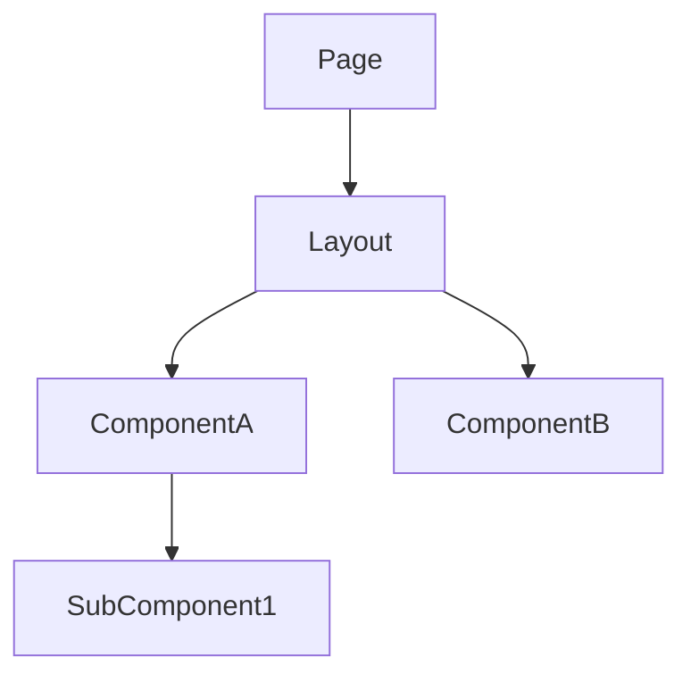
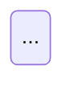

# Template: architecture-frontend.md

Inspired by: rcherny Front-End Architecture Checklist + component-driven design.

**Generate when:** frontend work is involved.

## Template

```markdown
# Arquitectura Frontend — <TASK-ID>

## Jerarquía de componentes



## Contratos de estado

<!-- TypeScript interfaces — executable spec. Must match backend OpenAPI schemas. -->

```typescript
// Derived from backend OpenAPI schemas
interface <RequestDTO> {
  field1: string;
  field2: number;
}

interface <ResponseDTO> {
  id: string;
  // ...
}

// Component props contracts
interface <ComponentName>Props {
  data: <ResponseDTO>;
  onAction: (id: string) => void;
  // ...
}

// Store/state contract
interface <Feature>State {
  items: <ResponseDTO>[];
  loading: boolean;
  error: string | null;
}
```

## Rutas y navegación

| Ruta | Componente | Guard | Lazy |
|---|---|---|---|

## Capa de integración API

<!-- How frontend consumes backend contracts -->
- **Cliente:** ...
- **Manejo de errores:** ...
- **Cache / revalidation:** ...

## Flujo de datos


```

## Rules

- TypeScript interfaces MUST match backend OpenAPI schemas — same field names, same types
- Component tree diagram shows composition, not implementation details
- Props contracts define the component's public API — what it receives and emits
- State contracts define the store shape — loading/error/data pattern
- Route table includes guards (auth, permissions) and lazy loading strategy
- If backend view exists, frontend interfaces are DERIVED from the OpenAPI spec — not independently defined
