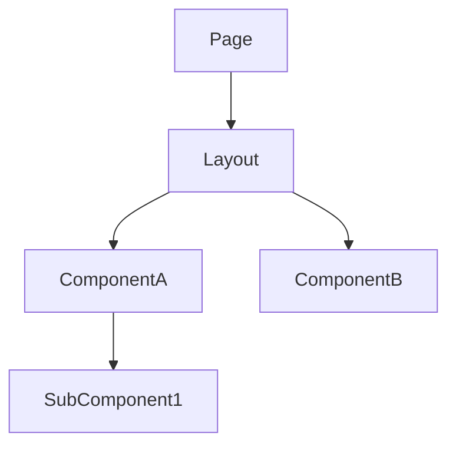
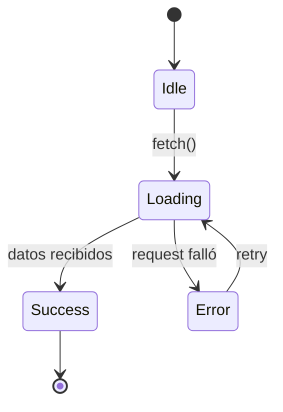

# Template: architecture-frontend.md

Inspirado en: rcherny Front-End Architecture Checklist + diseño component-driven.

**Generar cuando:** hay trabajo de frontend involucrado.

## Template

```markdown
# Arquitectura Frontend — <TASK-ID>

## Alcance del cambio

### In scope
- <qué sistemas, módulos, archivos y comportamientos ESTÁN incluidos en este cambio>

### Out of scope
- <qué NO está incluido — explícito, no asumido>

### Archivos involucrados

| Archivo | Acción | Capa | Justificación |
|---|---|---|---|
| `path/al/archivo` | CREATE / MODIFY / DELETE | dominio / handler / repo / infra / ui | razón de ubicación |

<!--
Instrucción para el architect: poblar esta tabla con TODOS los archivos que toca el feature.
Los archivos NEW (acción CREATE) deben tener justificación de ubicación explícita.
Esta tabla es el contrato de handoff hacia el `spec-writer`.
-->

---

## Patrones de integración usados

<!-- Marcar cuáles aplican. Incluir solo esas secciones abajo. -->
- [ ] REST / HTTP (fetch, axios, Tauri invoke)
- [ ] WebSockets / SSE (tiempo real)
- [ ] Eventos recibidos del backend (event bus, broadcast)
- [ ] Polling
- [ ] Estado local únicamente (sin backend)

---

## Jerarquía de componentes



## Contratos de tipos

<!-- Interfaces TypeScript. Deben coincidir con contratos backend exactamente — mismos nombres de campo, mismos tipos. -->

```typescript
// Derivado de contratos REST/command del backend
interface <ResponseDTO> {
  id: string;
  // ...
}

// Props del componente
interface <ComponentName>Props {
  data: <ResponseDTO>;
  onAction: (id: string) => void;
}

// Forma del store / estado
interface <Feature>State {
  items: <ResponseDTO>[];
  loading: boolean;
  error: string | null;
}
```

## Capa de integración

<!-- Cómo el frontend consume cada patrón del backend -->

### REST / Tauri invoke
- **Cliente:** fetch / axios / invoke — cuál y por qué
- **Manejo de errores:** qué hace el UI ante 4xx / 5xx / timeout
- **Cache / revalidation:** estrategia (stale-while-revalidate, no-cache, etc.)

### WebSockets / SSE — incluir si aplica
- **Endpoint / topic:** ...
- **Reconexión:** estrategia (backoff, límite de intentos)
- **Estado de conexión:** cómo lo expone el UI (indicador, fallback)
- **Mensajes esperados:** schema de cada mensaje recibido

### Polling — incluir si aplica
- **Intervalo:** ...
- **Condición de stop:** ...
- **Qué activa un re-fetch:** ...

---

## Máquina de estados de la entidad principal — incluir si aplica



## Variables de entorno del cliente — incluir si aplica

<!-- Env vars expuestas al browser/cliente. NUNCA secretos aquí — todo es público. -->

| Variable | Ejemplo | Framework | Descripción |
|---|---|---|---|
| `VITE_API_URL` | `http://localhost:8080` | Vite | URL base de la API |

### Convenciones por framework

| Framework | Prefijo obligatorio | Acceso en código | Archivo |
|---|---|---|---|
| **Vite** | `VITE_` | `import.meta.env.VITE_*` | `.env`, `.env.local` |
| **Next.js** | `NEXT_PUBLIC_` | `process.env.NEXT_PUBLIC_*` | `.env.local` |
| **Create React App** | `REACT_APP_` | `process.env.REACT_APP_*` | `.env` |
| **Astro** | `PUBLIC_` | `import.meta.env.PUBLIC_*` | `.env` |
| **Nuxt** | `NUXT_PUBLIC_` | `useRuntimeConfig().public.*` | `.env` |

**Reglas:**
- Sin el prefijo del framework, la variable NO se expone al cliente — esto es intencional (seguridad)
- **Nunca** poner API keys, secrets, o tokens en env vars del cliente — son visibles en el bundle
- Env vars del cliente van en `.env.example` con el prefijo correcto
- Variables server-side (SSR de Next/Nuxt) no necesitan prefijo público — tratarlas como backend

### Variables comunes de frontend

| Variable | Uso |
|---|---|
| `VITE_API_URL` / `NEXT_PUBLIC_API_URL` | URL base del backend |
| `VITE_WS_URL` / `NEXT_PUBLIC_WS_URL` | URL del WebSocket |
| `VITE_APP_ENV` | Entorno (development / staging / production) |
| `VITE_SENTRY_DSN` | DSN de Sentry para error tracking del cliente |
| `VITE_ANALYTICS_ID` | ID de Google Analytics / Plausible / etc. |
| `VITE_FEATURE_*` | Feature flags del cliente |

## Rutas y navegación

| Ruta | Componente | Guard | Lazy |
|---|---|---|---|

## Flujo de datos

```mermaid
sequenceDiagram
  ...
```
```

## Reglas

- Las interfaces TypeScript DEBEN coincidir con contratos backend — mismos nombres de campo, mismos tipos, mismo optional/required
- Incluir SOLO secciones que apliquen — omitir secciones vacías completamente
- La sección WebSocket/SSE es obligatoria si el backend emite eventos en tiempo real — no describir como "polling" si es push
- Diagrama de máquina de estados requerido para entidades con más de 2 estados de UI (loading/error/success/empty/stale)
- Los contratos de props definen la API pública del componente — qué recibe y emite
- La tabla de rutas incluye guards (auth, permisos) y estrategia de lazy loading
- Si existe vista backend, las interfaces frontend se DERIVAN de esos contratos — no se definen independientemente
- Las env vars del cliente son PÚBLICAS — nunca secretos. Si necesitas un secret en SSR (Next/Nuxt), documentarlo sin prefijo público y tratarlo como backend
- Toda env var nueva debe agregarse al `.env.example` con el prefijo correcto del framework
