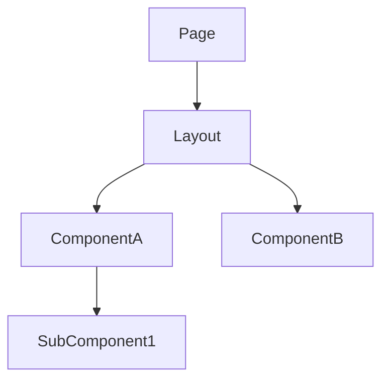
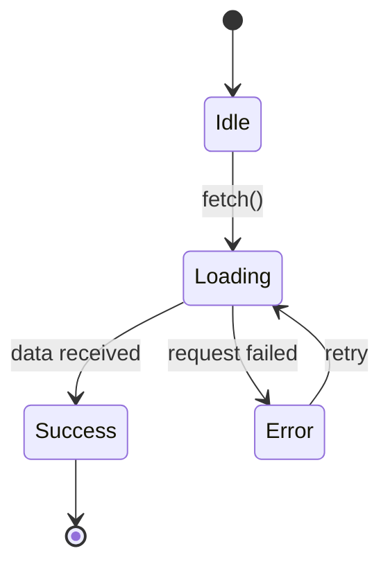

# Template: architecture-frontend.md

Inspired by: rcherny Front-End Architecture Checklist + component-driven design.

**Generate when:** frontend work is involved.

## Template

```markdown
# Arquitectura Frontend — <TASK-ID>

## Patrones de integración usados

<!-- Mark which apply. Include only those sections below. -->
- [ ] REST / HTTP (fetch, axios, Tauri invoke)
- [ ] WebSockets / SSE (tiempo real)
- [ ] Eventos recibidos del backend (event bus, broadcast)
- [ ] Polling
- [ ] Estado local únicamente (sin backend)

---

## Jerarquía de componentes



## Contratos de tipos

<!-- TypeScript interfaces. Must match backend contracts exactly — same field names, same types. -->

```typescript
// Derived from backend REST/command contracts
interface <ResponseDTO> {
  id: string;
  // ...
}

// Component props
interface <ComponentName>Props {
  data: <ResponseDTO>;
  onAction: (id: string) => void;
}

// Store / state shape
interface <Feature>State {
  items: <ResponseDTO>[];
  loading: boolean;
  error: string | null;
}
```

## Capa de integración

<!-- How frontend consumes each backend pattern -->

### REST / Tauri invoke
- **Cliente:** fetch / axios / invoke — cuál y por qué
- **Manejo de errores:** qué hace el UI ante 4xx / 5xx / timeout
- **Cache / revalidation:** strategy (stale-while-revalidate, no-cache, etc.)

### WebSockets / SSE — incluir si aplica
- **Endpoint / topic:** ...
- **Reconexión:** estrategia (backoff, límite de intentos)
- **Estado de conexión:** cómo lo expone el UI (indicador, fallback)
- **Mensajes esperados:** schema de cada mensaje recibido

### Polling — incluir si aplica
- **Intervalo:** ...
- **Condición de stop:** ...
- **Qué activa un re-fetch:** ...

---

## Máquina de estados de la entidad principal — incluir si aplica



## Rutas y navegación

| Ruta | Componente | Guard | Lazy |
|---|---|---|---|

## Flujo de datos

```mermaid
sequenceDiagram
  ...
```
```

## Rules

- TypeScript interfaces MUST match backend contracts — same field names, same types, same optional/required
- Include ONLY sections that apply — omit empty sections entirely
- WebSocket/SSE section is mandatory if backend emits real-time events — do not describe as "polling" if it's push
- State machine diagram required for any entity with more than 2 UI states (loading/error/success/empty/stale)
- Props contracts define the component's public API — what it receives and emits
- Route table includes guards (auth, permissions) and lazy loading strategy
- If backend view exists, frontend interfaces are DERIVED from those contracts — not independently defined
