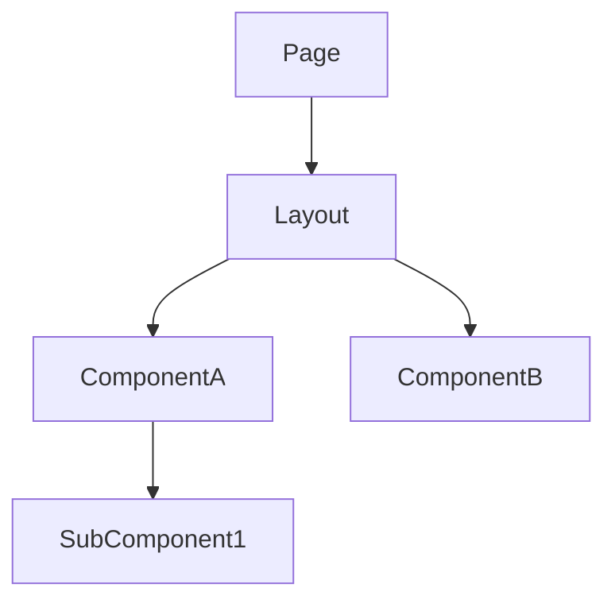
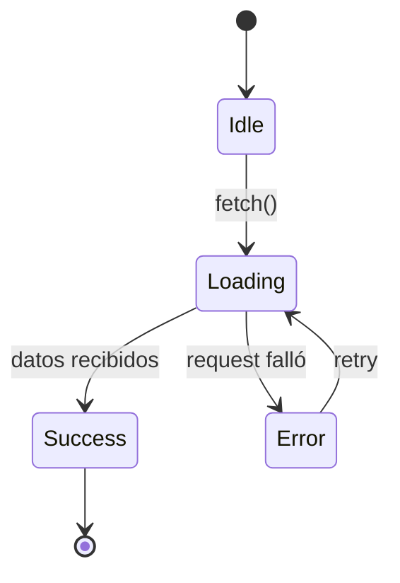

# Template: architecture-frontend.md

Inspirado en: rcherny Front-End Architecture Checklist + diseño component-driven.

**Generar cuando:** hay trabajo de frontend involucrado.

## Template

```markdown
# Arquitectura Frontend — <TASK-ID>

## Patrones de integración usados

<!-- Marcar cuáles aplican. Incluir solo esas secciones abajo. -->
- [ ] REST / HTTP (fetch, axios, Tauri invoke)
- [ ] WebSockets / SSE (tiempo real)
- [ ] Eventos recibidos del backend (event bus, broadcast)
- [ ] Polling
- [ ] Estado local únicamente (sin backend)

---

## Jerarquía de componentes



## Contratos de tipos

<!-- Interfaces TypeScript. Deben coincidir con contratos backend exactamente — mismos nombres de campo, mismos tipos. -->

```typescript
// Derivado de contratos REST/command del backend
interface <ResponseDTO> {
  id: string;
  // ...
}

// Props del componente
interface <ComponentName>Props {
  data: <ResponseDTO>;
  onAction: (id: string) => void;
}

// Forma del store / estado
interface <Feature>State {
  items: <ResponseDTO>[];
  loading: boolean;
  error: string | null;
}
```

## Capa de integración

<!-- Cómo el frontend consume cada patrón del backend -->

### REST / Tauri invoke
- **Cliente:** fetch / axios / invoke — cuál y por qué
- **Manejo de errores:** qué hace el UI ante 4xx / 5xx / timeout
- **Cache / revalidation:** estrategia (stale-while-revalidate, no-cache, etc.)

### WebSockets / SSE — incluir si aplica
- **Endpoint / topic:** ...
- **Reconexión:** estrategia (backoff, límite de intentos)
- **Estado de conexión:** cómo lo expone el UI (indicador, fallback)
- **Mensajes esperados:** schema de cada mensaje recibido

### Polling — incluir si aplica
- **Intervalo:** ...
- **Condición de stop:** ...
- **Qué activa un re-fetch:** ...

---

## Máquina de estados de la entidad principal — incluir si aplica



## Rutas y navegación

| Ruta | Componente | Guard | Lazy |
|---|---|---|---|

## Flujo de datos

```mermaid
sequenceDiagram
  ...
```
```

## Reglas

- Las interfaces TypeScript DEBEN coincidir con contratos backend — mismos nombres de campo, mismos tipos, mismo optional/required
- Incluir SOLO secciones que apliquen — omitir secciones vacías completamente
- La sección WebSocket/SSE es obligatoria si el backend emite eventos en tiempo real — no describir como "polling" si es push
- Diagrama de máquina de estados requerido para entidades con más de 2 estados de UI (loading/error/success/empty/stale)
- Los contratos de props definen la API pública del componente — qué recibe y emite
- La tabla de rutas incluye guards (auth, permisos) y estrategia de lazy loading
- Si existe vista backend, las interfaces frontend se DERIVAN de esos contratos — no se definen independientemente
