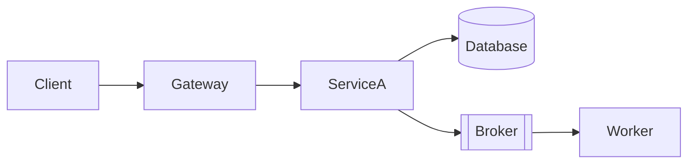

# Template: architecture-infra.md

Inspired by: AWS Well-Architected + bflorat Infrastructure View.

**Generate when:** infrastructure changes are involved.

## Template

```markdown
# Arquitectura de Infraestructura — <TASK-ID>

## Componentes involucrados

<!-- Mark which apply -->
- [ ] Servicios / containers (API, workers, schedulers)
- [ ] Message broker (Kafka / RabbitMQ / SQS / Redis Streams)
- [ ] Base de datos
- [ ] Cache (Redis, Memcached)
- [ ] CDN / storage (S3, GCS)
- [ ] Cron / scheduled jobs
- [ ] API Gateway / load balancer

---

## Topología de despliegue



## Brokers y colas — incluir si aplica

| Broker | Topic / Queue | Producers | Consumers | Retención | DLQ |
|---|---|---|---|---|---|

- **Modo de entrega:** at-most-once / at-least-once / exactly-once
- **Escalado de consumers:** estrategia (consumer groups, concurrency)
- **Backpressure:** qué pasa si el consumer no puede seguir el ritmo

## Variables de entorno y secretos

| Variable | Tipo | Descripción | Requerida |
|---|---|---|---|

## Escalabilidad

- **Triggers de escalado:** ...
- **Límites de recursos (CPU/mem):** ...
- **Bottlenecks conocidos:** ...

## SLOs y supuestos de capacidad

- **Latencia objetivo (p95):** ...
- **Throughput esperado:** ...
- **Presupuesto de fallos:** % de errores aceptable antes de alerta

## Observabilidad

- **Métricas clave:** qué counters/gauges/histograms emite esta feature
- **Alertas:** qué condición dispara una alerta (ej. DLQ > 0, latencia p95 > 500ms)
- **Logs estructurados:** qué campos obligatorios en cada log line

## Impacto CI/CD

<!-- Specific pipeline files that need changes -->
- ...

## Seguridad de infraestructura

- **Red:** segmentación, puertos expuestos
- **Secretos:** dónde se almacenan, cómo se inyectan
- **Acceso:** IAM roles, service accounts, mínimo privilegio
```

## Rules

- Include ONLY sections that apply — omit empty sections entirely
- Brokers/queues section is mandatory if any async pattern is used — document DLQ always
- SLOs section required for Medium+ tasks — "N/A" only if explicitly a background job with no user impact
- Observability section must name specific metrics — "add logging" is not enough
- Deployment diagram shows services and connections — not internal code
- Every env var must specify type (string, int, bool, secret) and whether it's required
- If backend view exists, env vars here must match backend config references exactly
