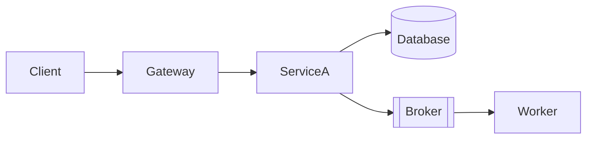

# Template: architecture-infra.md

Inspirado en: AWS Well-Architected + bflorat Infrastructure View.

**Generar cuando:** hay cambios de infraestructura involucrados.

## Template

```markdown
# Arquitectura de Infraestructura — <TASK-ID>

## Componentes involucrados

<!-- Marcar cuáles aplican -->
- [ ] Servicios / containers (API, workers, schedulers)
- [ ] Message broker (Kafka / RabbitMQ / SQS / Redis Streams)
- [ ] Base de datos
- [ ] Cache (Redis, Memcached)
- [ ] CDN / storage (S3, GCS)
- [ ] Cron / scheduled jobs
- [ ] API Gateway / load balancer

---

## Topología de despliegue



## Brokers y colas — incluir si aplica

| Broker | Topic / Queue | Producers | Consumers | Retención | DLQ |
|---|---|---|---|---|---|

- **Modo de entrega:** at-most-once / at-least-once / exactly-once
- **Escalado de consumers:** estrategia (consumer groups, concurrency)
- **Backpressure:** qué pasa si el consumer no puede seguir el ritmo

## Variables de entorno y secretos

| Variable | Tipo | Descripción | Requerida |
|---|---|---|---|

## Escalabilidad

- **Triggers de escalado:** ...
- **Límites de recursos (CPU/mem):** ...
- **Bottlenecks conocidos:** ...

## SLOs y supuestos de capacidad

- **Latencia objetivo (p95):** ...
- **Throughput esperado:** ...
- **Presupuesto de fallos:** % de errores aceptable antes de alerta

## Observabilidad

- **Métricas clave:** qué counters/gauges/histograms emite esta feature
- **Alertas:** qué condición dispara una alerta (ej. DLQ > 0, latencia p95 > 500ms)
- **Logs estructurados:** qué campos obligatorios en cada log line

## Impacto CI/CD

<!-- Archivos de pipeline específicos que necesitan cambios -->
- ...

## Seguridad de infraestructura

- **Red:** segmentación, puertos expuestos
- **Secretos:** dónde se almacenan, cómo se inyectan
- **Acceso:** IAM roles, service accounts, mínimo privilegio
```

## Reglas

- Incluir SOLO secciones que apliquen — omitir secciones vacías completamente
- La sección de brokers/colas es obligatoria si se usa cualquier patrón async — documentar DLQ siempre
- La sección de SLOs es requerida para tareas Medium+ — "N/A" solo si explícitamente es un job background sin impacto al usuario
- La sección de observabilidad debe nombrar métricas específicas — "agregar logging" no es suficiente
- El diagrama de despliegue muestra servicios y conexiones — no código interno
- Cada env var debe especificar tipo (string, int, bool, secret) y si es requerida
- Si existe vista backend, las env vars aquí deben coincidir con las referencias de config backend exactamente
