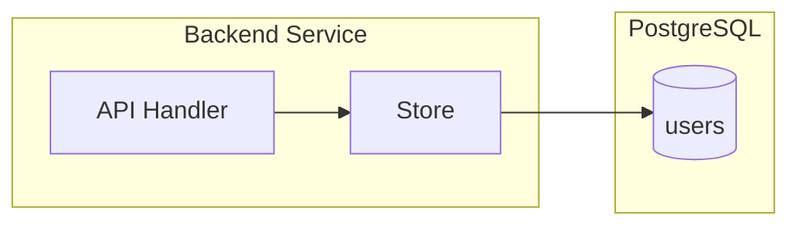
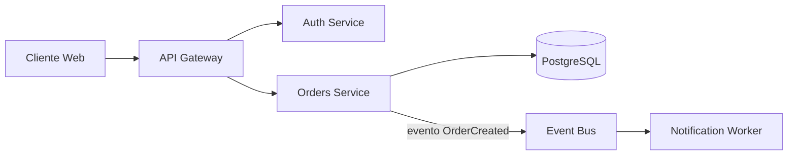
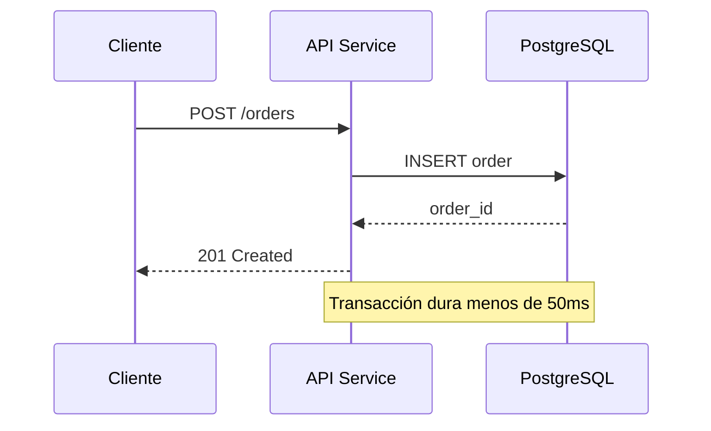
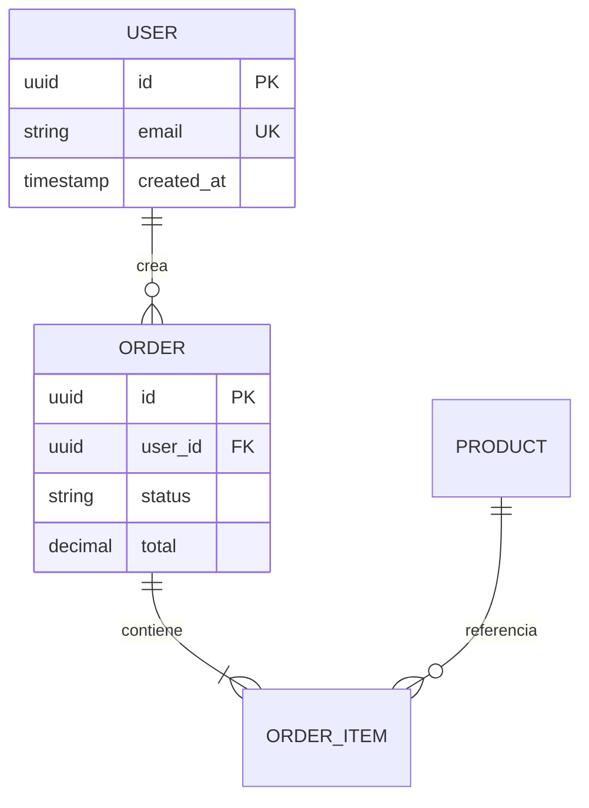
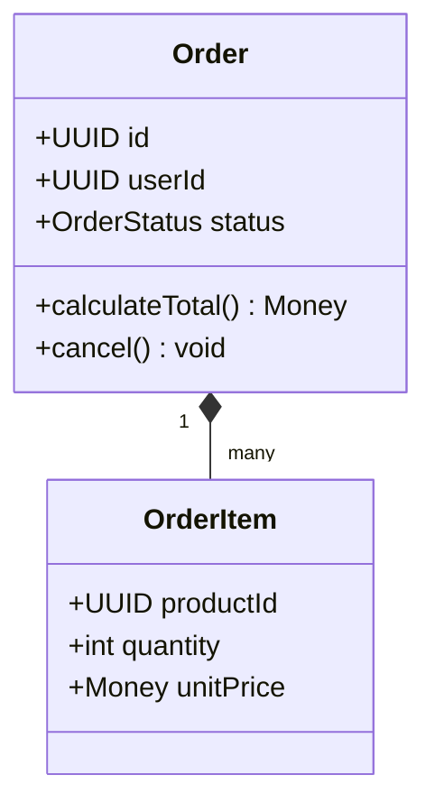
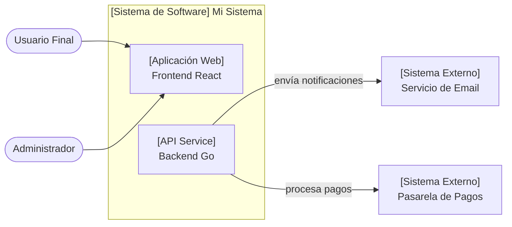
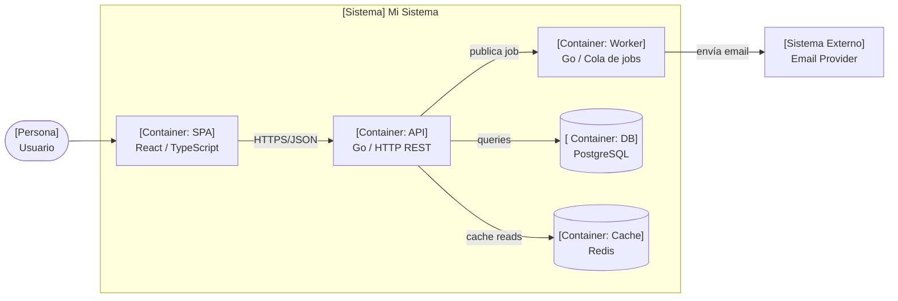
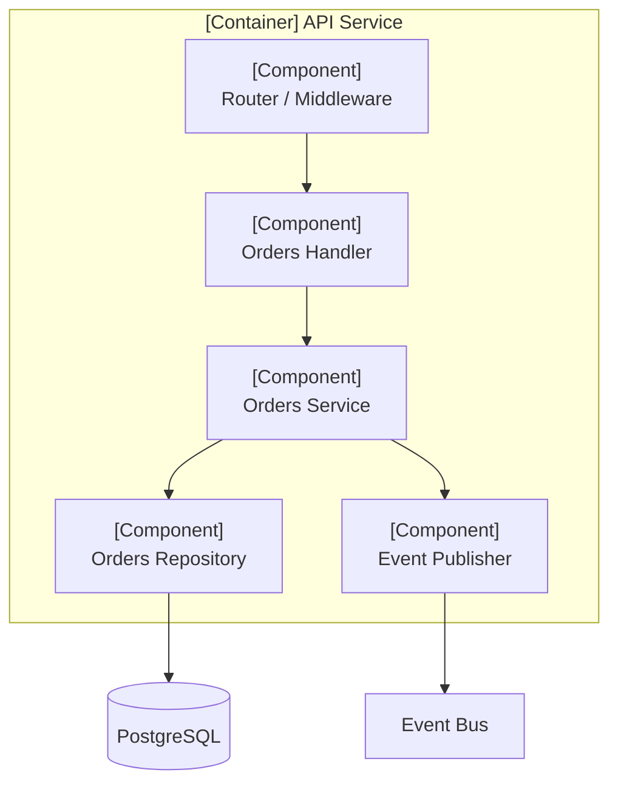

# Skill — generate-diagram (Mermaid embebido)

Produce bloques Mermaid.js sintácticamente válidos para embeber en archivos Markdown. La skill cubre Mermaid v10+ y se enfoca en evitar los errores de sintaxis que más rompen el renderizado.

## Cuándo usar esta skill vs `drawio`

| Necesidad | Skill correcta |
|---|---|
| Diagrama dentro de un `.md` (Architecture Views / ADRs, README, spec) | `generate-diagram` (Mermaid) |
| Diagrama standalone editable (`.drawio`) para arquitectura técnica detallada con shapes ricos, message brokers, gateways | `drawio` |
| Diagrama que viaja con la documentación y debe renderizarse en GitHub/Obsidian/Outline | `generate-diagram` |
| Diagrama que se exporta a PNG/SVG para slides o whiteboards técnicos | `drawio` |

Regla: si el output final es un archivo `.md` que renderiza el diagrama inline, usar Mermaid. Si el artefacto es un archivo independiente que se edita visualmente, usar drawio.

## Tipos de diagrama soportados

Usar el keyword exacto de apertura. Mermaid v10+ deprecó `graph` — usar siempre `flowchart`.

| Tipo | Keyword de apertura | Caso de uso |
|---|---|---|
| Flowchart horizontal | `flowchart LR` | Flujos de proceso, pipelines, flujo de datos izquierda→derecha |
| Flowchart vertical | `flowchart TD` | Árboles de decisión, jerarquías top-down |
| Diagrama de secuencia | `sequenceDiagram` | Interacción async/sync entre componentes, llamadas API |
| Diagrama de clases | `classDiagram` | Estructura de tipos, herencia, interfaces |
| Diagrama Entidad-Relación | `erDiagram` | Schema de base de datos, relaciones entre tablas |
| Máquina de estados | `stateDiagram-v2` | FSMs, ciclos de vida, transiciones |
| C4-style (flowchart) | `flowchart LR` | Vistas C4 L1 Context, L2 Container, L3 Component — usando subgraphs y convenciones de color/shape C4 |
| Git graph | `gitGraph` | Estrategia de branching, releases |

**Nota sobre C4 nativo:** Los keywords `C4Context`, `C4Container`, `C4Component`, `C4Dynamic` y `C4Deployment` de Mermaid son **experimentales** — la sintaxis puede cambiar en cualquier release sin aviso. No usarlos en documentación de larga vida. Usar en su lugar `flowchart LR` con subgraphs siguiendo las convenciones C4-style de la sección de patrones de esta skill.

---

## Reglas de caracteres especiales en labels (CRÍTICO)

La causa más común de Mermaid roto son caracteres especiales sin escapar dentro de labels. Aplicar estas reglas siempre.

### Dentro de `[]`, `()`, `{}` (formas de nodo)

Caracteres prohibidos sin envolver en comillas: `:`, `(`, `)`, `"`, `/`, `#`, `&`.

Reglas:

- Si el label tiene **paréntesis** → envolver el texto completo en comillas: `A["Crear Orden (v2)"]`
- Si el label tiene **dos puntos** → reemplazar por ` -` o reformular: `A[Estado - activo]` en vez de `A[Estado: activo]`
- Si el label tiene **slash** → envolver en comillas: `A["Lectura/Escritura"]`
- Si el label tiene **comillas internas** → escapar con `&quot;` o reformular
- **Regla general:** ante cualquier duda, envolver el label en comillas dobles. Un label con comillas siempre es seguro.

### Dentro de labels de flecha (`-- texto -->`)

- Caracteres problemáticos: `:`, `-` solo (puede confundirse con flecha), `|` (delimita labels en `-->|texto|`)
- Dos puntos en label de flecha → reformular sin `:`
- Guion solo → reemplazar por `—` (em dash) o palabra equivalente
- Para labels complejos, preferir la forma con pipes: `A -- "texto: con caracteres" --> B` también requiere comillas si tiene `:`

### Comillas escapadas

Si el label necesita comillas internas: `A["Etiqueta con \"interna\""]` no es válido en Mermaid. Usar `&quot;`: `A["Etiqueta con &quot;interna&quot;"]`.

---

## Reglas de subgraph



Reglas:

- El **ID del subgraph** (primer token después de `subgraph`) NO puede tener espacios, paréntesis ni caracteres especiales. Usar `camelCase`, `snake_case` o `kebab-case`.
- El **título legible** va entre `[...]` después del ID. Aplican las mismas reglas de caracteres que para nodos.
- Siempre cerrar con `end` en su propia línea.
- Los IDs deben ser únicos en todo el diagrama — un nodo y un subgraph no pueden compartir ID.

---

## Snippets mínimos funcionales

### Flowchart (flujo de datos)



### Diagrama de secuencia



### Diagrama Entidad-Relación



### Diagrama de clases



---

## Patrones C4 con flowchart estable

Estos patrones reemplazan a los keywords experimentales `C4Context`/`C4Container`. Usan `flowchart` (estable desde Mermaid v8) y convenciones visuales C4-style aplicadas mediante shapes y labels.

### Convenciones visuales C4-style

- **Personas/actores:** forma redonda `(["Nombre"])` o `([Nombre])`
- **Sistemas externos:** caja simple `["[Sistema Externo]\nNombre"]`
- **Contenedores:** caja con tipo en label `["[Container: tipo]\nNombre"]`
- **Componentes:** caja con tipo en label `["[Component]\nNombre"]`
- **Bases de datos:** forma cilindro `[("Nombre")]`
- **Boundaries de sistema/container:** agrupar con `subgraph`

### C4 Level 1 — System Context

El sistema en su entorno: usuarios y sistemas externos con los que interactúa.



### C4 Level 2 — Container

Los contenedores desplegables del sistema (apps, servicios, bases de datos, brokers).



### C4 Level 3 — Component

Los componentes internos de un container específico.



---

## Checklist de validación (OBLIGATORIO antes de entregar)

Antes de cerrar cualquier documento que incluya un bloque Mermaid, verificar cada punto:

- [ ] El bloque abre con el keyword correcto (`flowchart LR`/`TD`, `sequenceDiagram`, `erDiagram`, `classDiagram`, `stateDiagram-v2`, `gitGraph`). **Nunca `graph`** — está deprecated en Mermaid v10+.
- [ ] Si se representa arquitectura estilo C4, usar `flowchart LR` con subgraphs (nunca `C4Context`/`C4Container` — son experimentales en Mermaid y su sintaxis puede cambiar sin aviso).
- [ ] Todos los nodos referenciados en edges/flechas están definidos en el diagrama (no hay edges huérfanos a IDs inexistentes).
- [ ] Ningún label sin comillas contiene `:`, `(`, `)`, `/`, `#`, `&` o `"` interno.
- [ ] Todos los subgraphs tienen ID sin espacios ni caracteres especiales y cierran con `end`.
- [ ] El bloque está encerrado en triple backtick con `mermaid` como language tag: ` ```mermaid ... ``` `.
- [ ] El diagrama cabe en una pantalla estándar (objetivo ≤15 nodos, ≤20 edges). Si excede, partir en varios diagramas con un foco distinto cada uno.
Si algún ítem falla → corregir antes de entregar.

---

## Anti-patrones comunes

| Anti-patrón | Forma correcta | Por qué |
|---|---|---|
| `graph LR` | `flowchart LR` | `graph` está deprecated en Mermaid v10+ |
| `A[Create Order (v2)]` | `A["Create Order (v2)"]` | Paréntesis sin comillas rompen el parser |
| `A -- texto: con dos puntos --> B` | `A -- "texto con guión" --> B` | Dos puntos en labels confunden al parser |
| `A[Estado: activo]` | `A[Estado - activo]` o `A["Estado: activo"]` | Dos puntos rompen labels de nodo |
| `subgraph My Backend` | `subgraph backend [My Backend]` | El ID no admite espacios |
| `A[Read/Write]` | `A["Read/Write"]` | Slash en label sin comillas |
| `A --> B --> ` (edge incompleto) | `A --> B` | Edges colgantes producen errores opacos |
| Definir `B` solo en un edge `A --> B` y nunca darle forma | `A --> B[Etiqueta de B]` | Sin forma definida, el nodo aparece como ID literal |
| Mezclar `participant` y nodos de flowchart | Elegir UNO: o `sequenceDiagram` o `flowchart` | Cada keyword tiene su propio léxico |
| `C4Context` / `C4Container` | `flowchart LR` con subgraphs | Syntax experimental en Mermaid — puede romperse con cualquier upgrade |

---

## Reglas operativas

- Colocar siempre el diagrama dentro de un bloque ` ```mermaid ... ``` `.
- Un diagrama por bloque — no concatenar dos tipos distintos en el mismo bloque.
- Preferir **diagramas de secuencia** para flujos asíncronos complejos (orden de mensajes importa).
- Preferir **flowchart** con subgraphs y convenciones C4-style para vistas de arquitectura (los keywords nativos `C4*` son experimentales y no se usan).
- Preferir **ER** para schema de base de datos — nunca usar flowchart para representar tablas.
- Mantener el diagrama **simple y enfocado**: una idea por diagrama. Si necesitas mostrar dos vistas (datos y secuencia), produce dos diagramas separados.
